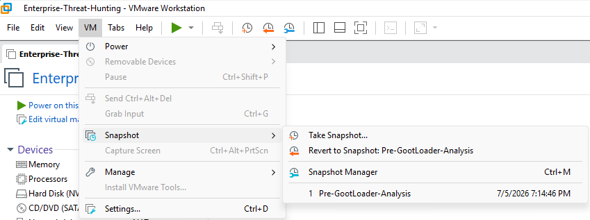
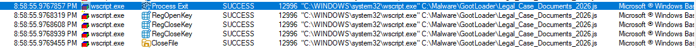
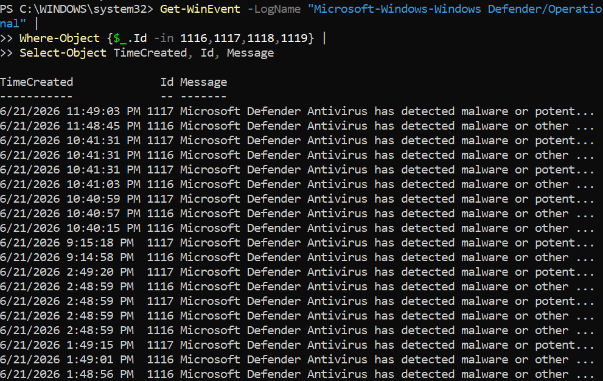
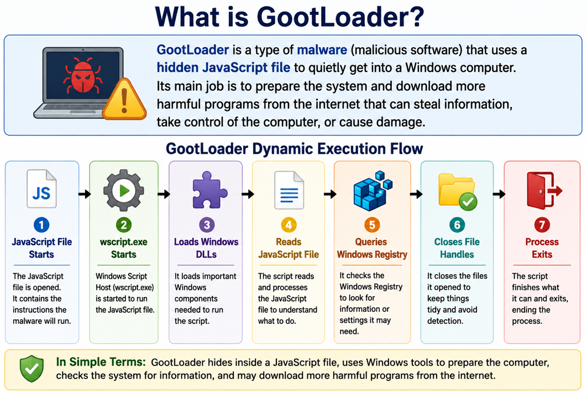

# Dynamic Analysis – GootLoader

## Executive Summary

This report documents the dynamic analysis of a GootLoader JavaScript malware sample.

The sample was executed in an isolated Windows malware analysis VM to observe runtime behavior in a controlled setting.

The sample executed through Windows Script Host, loaded system components, queried the registry, performed file activity, and exited quickly without observable second-stage behavior.

No child processes, payload execution, domains, IP addresses, or confirmed persistence were observed during this investigation.

---

## Analysis Objectives

* Safely execute the sample in an isolated VM.
* Observe process activity.
* Review registry activity.
* Review file activity.
* Check Microsoft Defender logs.
* Check for network indicators.
* Document what was observed and not observed.

---

## Lab Environment

| Component | Details |
| --- | --- |
| Host Platform | VMware Workstation |
| Guest OS | Windows Malware Analysis VM |
| Sample Location | `C:\Malware\GootLoader\Legal_Case_Documents_2026.js` |
| Execution Process | `wscript.exe` |
| Monitoring Tools | Process Monitor, Microsoft Defender, Wireshark |
| Safety Control | Pre-execution VMware snapshot |

The VM snapshot preserved the lab state before analysis.



---

## Execution Method

The JavaScript sample was launched using Windows Script Host.

This report does not include unsafe step-by-step detonation instructions. The command line below is included only as observed evidence from the analysis.

```text
"C:\WINDOWS\system32\wscript.exe" C:\Malware\GootLoader\Legal_Case_Documents_2026.js
```

### Simple Summary

Windows used `wscript.exe` to open and run the JavaScript file.

---

## Process Activity

The process `wscript.exe` started successfully.

Windows Script Host loaded required Windows DLLs. Thread activity, registry queries, and file activity were observed.

The process exited successfully. No child processes were observed.



| Observation | Result |
| --- | --- |
| `wscript.exe` execution | Observed |
| DLL loading | Observed |
| Registry queries | Observed |
| File activity | Observed |
| Child processes | Not observed |
| Process exit | Observed |

### Simple Summary

The script ran, performed limited Windows activity, and stopped without launching another process.

---

## Registry Activity

Registry queries were observed during execution.

The malware process checked Windows settings, but no confirmed persistence registry keys were created during this analysis.

| Registry Activity | Result |
| --- | --- |
| RegOpenKey | Observed |
| RegQueryValue | Observed |
| RegCloseKey | Observed |
| Registry persistence | Not observed |

---

## File Activity

File operations were observed during execution.

The script file was accessed, and file handles were closed. No dropped payloads or new executable files were confirmed.

| File Activity | Result |
| --- | --- |
| Script file access | Observed |
| File handle close | Observed |
| Dropped payload | Not observed |
| New executable created | Not observed |

---

## Network Activity

No domains, IP addresses, URLs, or outbound network indicators were observed during this investigation.

No HTTP or HTTPS traffic was confirmed. No DNS queries were confirmed.

Behavior may differ in a real user environment or if additional runtime conditions are met.

| Network Indicator | Result |
| --- | --- |
| Domains | None observed |
| IP addresses | None observed |
| URLs | None observed |
| HTTP/HTTPS traffic | None confirmed |
| DNS queries | None confirmed |

---

## Microsoft Defender Analysis

Microsoft Defender logs were reviewed during the investigation.

Defender Operational logs showed historical malware detection events. During the GootLoader analysis period, no Defender detection event was confirmed for the sample.

The Defender logs helped validate that no detection was recorded for this execution.



---

## Dynamic Execution Flow



| Step | Description |
| --- | --- |
| `Legal_Case_Documents_2026.js` | JavaScript sample used in the lab. |
| `wscript.exe` starts | Windows Script Host runs the script. |
| Loads Windows DLLs | Required system components are loaded. |
| Reads JavaScript file | The script file is accessed. |
| Queries Windows Registry | Registry keys and values are checked. |
| Closes file handles | File access is closed. |
| Process exits | The observed process ends quickly. |

### Flow View

```text
Legal_Case_Documents_2026.js
    |
    v
wscript.exe starts
    |
    v
Loads Windows DLLs
    |
    v
Reads JavaScript file
    |
    v
Queries Windows Registry
    |
    v
Closes file handles
    |
    v
Process exits
```

---

## Indicators Observed During Dynamic Analysis

| Type | Indicator |
| --- | --- |
| Process | `wscript.exe` |
| Script | `Legal_Case_Documents_2026.js` |
| Activity | Registry queries |
| Activity | File operations |
| Network | No domains or IPs observed |
| Child Processes | None observed |

---

## MITRE ATT&CK Mapping

| Tactic | Technique | ID | Simple Meaning |
| --- | --- | --- | --- |
| Execution | Command and Scripting Interpreter: JavaScript | T1059.007 | Malware ran through Windows Script Host |
| Defense Evasion | Obfuscated Files or Information | T1027 | Malware hid its logic using obfuscated JavaScript |

---

## Key Findings

* The sample executed through `wscript.exe`.
* Runtime DLL loading was observed.
* Registry queries were observed.
* File activity was observed.
* The process exited quickly.
* No child processes were observed.
* No network IOCs were observed.
* No confirmed persistence was observed.
* No Defender detection was confirmed for this execution.

---

## Analyst Assessment

The GootLoader sample executed successfully but did not progress to observable second-stage behavior in the isolated lab.

Analyst hypothesis: this may indicate the sample required additional runtime conditions, network availability, or a non-analysis environment.

The reason for early termination could not be confirmed based on the available evidence.

---

## Conclusion

Dynamic analysis confirmed Windows Script Host execution and limited runtime activity.

The observed behavior supported MITRE ATT&CK mapping and detection engineering even though no child process, payload execution, network activity, or persistence was confirmed.

This project produced defensive value by documenting what happened, what did not happen, and how the behavior can support future threat hunting.

---

## References

* [Microsoft Sysinternals Process Monitor](https://learn.microsoft.com/sysinternals/downloads/procmon)
* Microsoft Defender Operational Logs
* [MITRE ATT&CK](https://attack.mitre.org/)
* [YARA Documentation](https://yara.readthedocs.io/)
