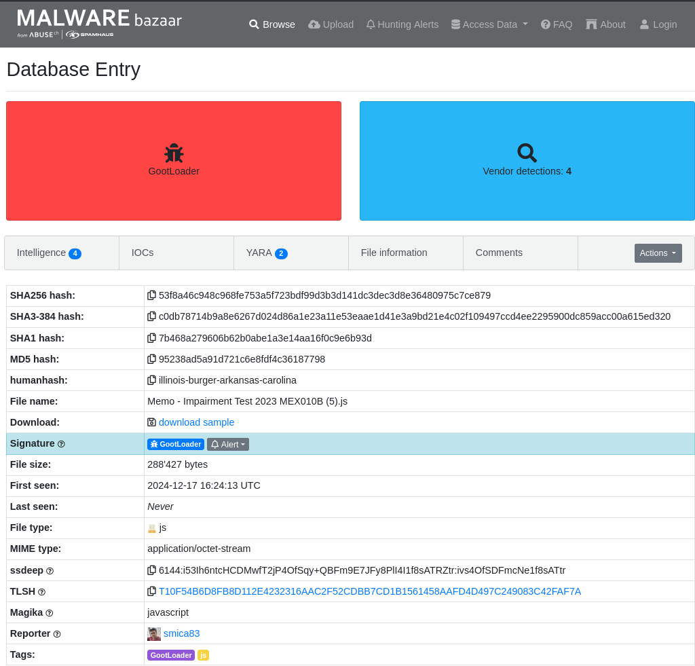
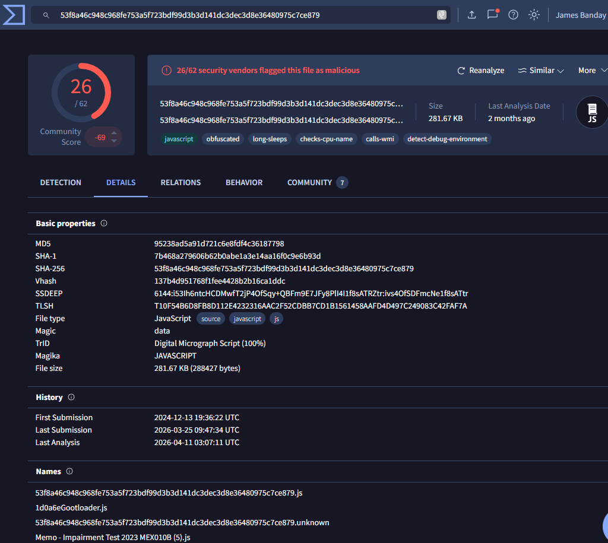
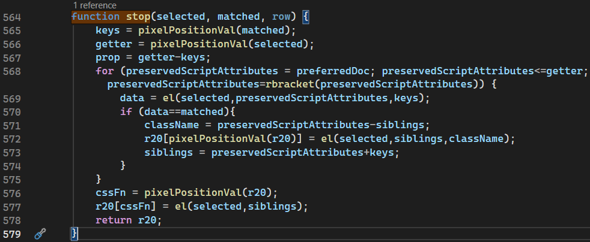
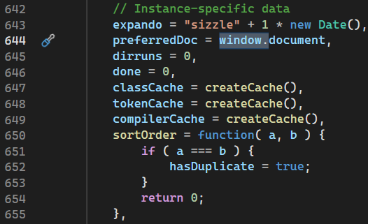
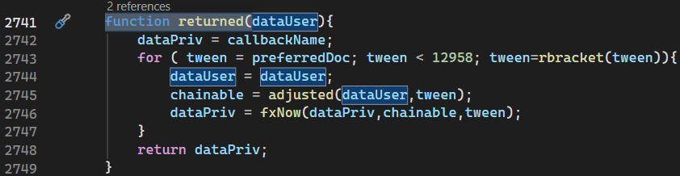
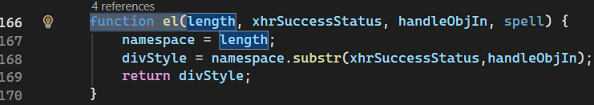
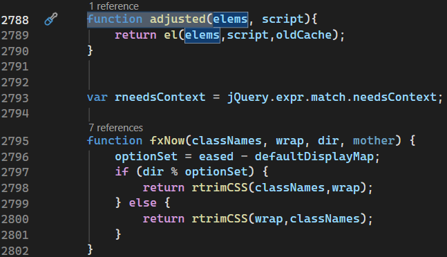
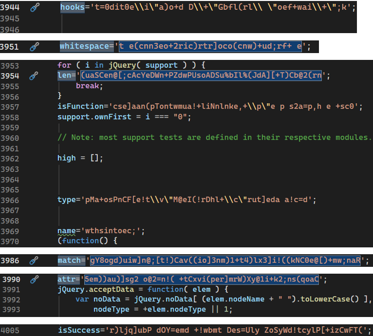
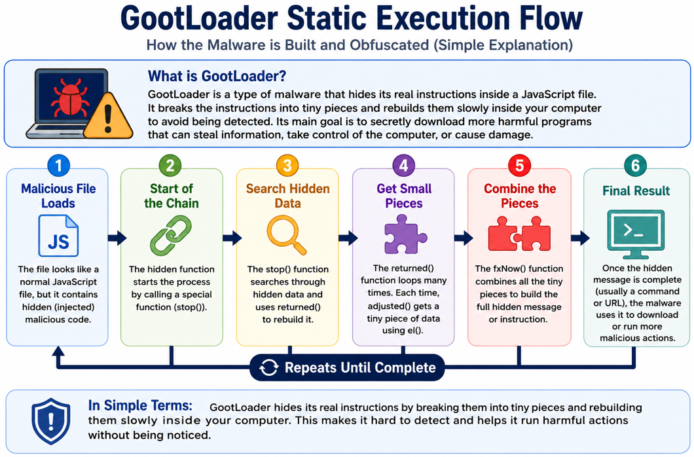
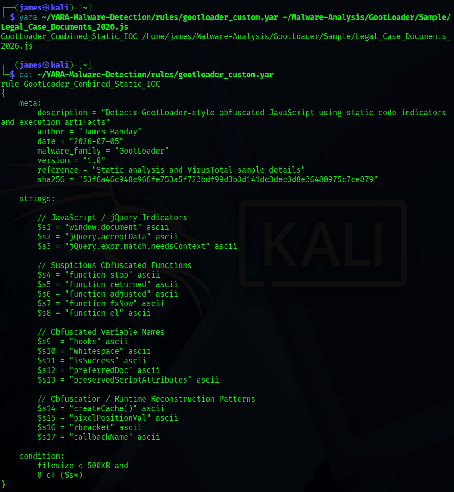

# Static Analysis – GootLoader

## Executive Summary

This report documents the static analysis of a GootLoader JavaScript malware sample.

Static analysis means reviewing a file before running it. This helps analysts identify risk, verify the sample, collect indicators, and plan safe follow-up analysis.

The analyzed lab file was named `Legal_Case_Documents_2026.js`. The original filename shown in threat intelligence sources was `Memo - Impairment Test 2023 MEXO10B (5).js`.

The review found heavily obfuscated JavaScript, legitimate jQuery code, injected suspicious functions, hidden strings, and runtime string reconstruction behavior.

No live malware, payloads, ZIP files, or unsafe execution instructions are included in this report.

---

## Analysis Objectives

* Identify the malware sample.
* Verify the file hash.
* Examine the JavaScript code safely.
* Identify obfuscation techniques.
* Collect Indicators of Compromise (IOCs).
* Map findings to MITRE ATT&CK.
* Develop detection content.

---

## Malware Sample Information

| Field | Value |
| --- | --- |
| Malware Family | GootLoader |
| File Type | JavaScript |
| Analysis File | `Legal_Case_Documents_2026.js` |
| Original File Name | `Memo - Impairment Test 2023 MEXO10B (5).js` |
| SHA-256 | `53f8a46c948c968fe753a5f723bdf99d3b3d141dc3dec3d8e36480975c7ce879` |
| SHA-1 | `7b468a279606b62b0abe1a3e14aa16f0c9e6b93d` |
| MD5 | `95238ad5a91d721c6e8fdf4c36187798` |
| File Size | `288427 bytes` |
| Source | MalwareBazaar |

### Simple Summary

This table identifies the exact file that was reviewed during the investigation.

---

## Threat Intelligence

Threat intelligence sources were used to confirm the sample identity and compare findings with external malware databases.

| Source | What It Provided |
| --- | --- |
| MalwareBazaar | Malware family, file hashes, original filename, file size, file type, and community malware metadata. |
| VirusTotal | Vendor detection context, file details, hash values, file type, and reputation information. |

### MalwareBazaar Evidence

MalwareBazaar showed the file as GootLoader and provided the hash values used to verify the sample.



### VirusTotal Evidence

VirusTotal showed external detection context and confirmed the same file hash details.



---

## Hash Verification

Hash verification confirms that analysts are reviewing the correct file.

| Hash Type | Purpose |
| --- | --- |
| MD5 | A short file fingerprint often used for quick comparison. |
| SHA-1 | A longer fingerprint used to compare the file with threat intelligence sources. |
| SHA-256 | A stronger fingerprint commonly used for malware tracking and detection. |

If the hash values match across tools and threat intelligence sources, confidence in the sample identity increases.

### Verified Hashes

| Type | Value |
| --- | --- |
| MD5 | `95238ad5a91d721c6e8fdf4c36187798` |
| SHA-1 | `7b468a279606b62b0abe1a3e14aa16f0c9e6b93d` |
| SHA-256 | `53f8a46c948c968fe753a5f723bdf99d3b3d141dc3dec3d8e36480975c7ce879` |

---

## JavaScript Analysis

The sample is a JavaScript file. Static review showed that it was heavily obfuscated.

Much of the file contained legitimate jQuery code. Suspicious functions were injected into that larger JavaScript content.

The malware used hidden strings and reconstruction logic to hide its real instructions until runtime.

### Simple Summary

The file mixed normal-looking JavaScript with hidden malicious logic. This made the suspicious parts harder to find.

### Injected Function Evidence



### Legitimate jQuery Code Evidence



### Function Review Evidence







### Obfuscated String Evidence



---

## Obfuscation Analysis

Attackers use obfuscation to make code harder to read, detect, and analyze.

In this sample, strings were hidden and rebuilt during runtime. This means important text was not clearly visible when the file was opened for review.

Runtime string reconstruction can make automated detection harder because the full behavior may not appear until the script starts running.

### Simple Summary

The malware tried to hide its real instructions by breaking them apart and rebuilding them later.

---

## Static Execution Flow



| Step | Description |
| --- | --- |
| JavaScript File | The sample starts as a JavaScript file. |
| Hidden Functions | Suspicious functions are hidden inside larger script content. |
| String Reconstruction | Hidden strings are rebuilt when the script runs. |
| Windows Script Host | The script is associated with Windows Script Host execution. |
| Potential Payload | A possible later stage is represented as a risk, not as an observed static finding. |

### Flow View

```text
JavaScript File
    |
    v
Hidden Functions
    |
    v
String Reconstruction
    |
    v
Windows Script Host
    |
    v
Potential Payload
```

---

## Indicators of Compromise (Static)

| IOC Type | Value |
| --- | --- |
| SHA-256 | `53f8a46c948c968fe753a5f723bdf99d3b3d141dc3dec3d8e36480975c7ce879` |
| SHA-1 | `7b468a279606b62b0abe1a3e14aa16f0c9e6b93d` |
| MD5 | `95238ad5a91d721c6e8fdf4c36187798` |
| Analysis File Name | `Legal_Case_Documents_2026.js` |
| Original File Name | `Memo - Impairment Test 2023 MEXO10B (5).js` |
| Execution Process | `wscript.exe` |
| Domains | No domains observed |
| IP Addresses | No IP addresses observed |

---

## MITRE ATT&CK Mapping

| Tactic | Technique | ID | Evidence |
| --- | --- | --- | --- |
| Execution | Command and Scripting Interpreter: JavaScript | T1059.007 | JavaScript executed through Windows Script Host. |
| Defense Evasion | Obfuscated Files or Information | T1027 | Obfuscated JavaScript concealed malicious functionality. |

### Simple Summary

The sample used JavaScript execution and obfuscation. These behaviors map to known MITRE ATT&CK techniques.

---

## Detection Engineering

Static analysis was used to create a custom YARA rule for this GootLoader sample.

The YARA rule successfully detected the malware sample during validation.

YARA helps analysts search for files that share known malware traits without needing to run the file.



---

## Key Findings

* Sample identified as GootLoader.
* Hash values verified.
* Heavy JavaScript obfuscation observed.
* Hidden functions identified.
* String reconstruction identified.
* MITRE ATT&CK techniques mapped.
* Custom YARA rule created and validated.

---

## Analyst Assessment

The GootLoader sample relied on JavaScript obfuscation and runtime string reconstruction to hide its behavior.

Static analysis provided enough evidence to identify key malware characteristics, document IOCs, map behavior to MITRE ATT&CK, and develop effective detection content.

This report does not claim payload execution or network communication from static analysis. Those behaviors were not observed in the confirmed static findings.

---

## References

* [MalwareBazaar](https://bazaar.abuse.ch/)
* [VirusTotal](https://www.virustotal.com/)
* [MITRE ATT&CK](https://attack.mitre.org/)
* [Microsoft Sysinternals](https://learn.microsoft.com/sysinternals/)
* [YARA Documentation](https://yara.readthedocs.io/)
