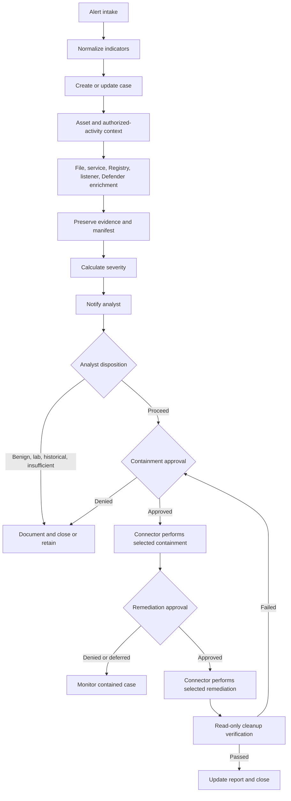

# Turla Neuron SOAR Workflow

## Plain-Language Workflow

When a security alert arrives, the workflow first gathers facts without changing the computer. It checks the file, service, Registry, local listener, antivirus status, and business role of the host. It then scores the evidence and alerts an analyst. Any action that could interrupt the computer requires explicit approval; permanent cleanup requires a second approval after evidence is preserved.

## Action Levels

| Level | Purpose | Examples | Approval |
|---|---|---|---|
| Automatic read-only | Gather and organize facts | Normalize, enrich, query state, preserve metadata, score, notify | None |
| Approval-required containment | Limit immediate risk | Isolate, block, stop/disable, suspend, quarantine, temporary firewall restriction | Explicit containment approval |
| Approval-required remediation | Permanently remove confirmed threat | Delete file, remove service/keys/source/storage, restore, reimage | Explicit remediation approval |

Case-management updates do not modify the endpoint. Connector implementations must still follow organizational data-handling controls.

## Alert Intake and Normalization

Supported sources are the existing Sigma service rule, exact and behavioral YARA matches, Microsoft Defender, EDR, local listener telemetry, and analyst-submitted IOC matches. The original alert is retained before normalization.

Canonical entities include endpoint, filename, path, SHA-256, service name/display name, detection name, and detection time. Every normalized value retains source provenance. Port 443 and PID 4 are tagged as context only.

## Read-Only Enrichment

### Asset and Authorization

Query the CMDB or approved asset inventory to determine:

- Is this a legitimate Exchange server?
- Is this approved malware-analysis or security-testing activity?
- What is the asset criticality and business owner?

These checks occur before any service action.

### File

Calculate available hashes, compare the exact SHA-256, query approved internal reputation sources, and collect signer, size, path, and temporal metadata. Do not execute the file.

### Service and Registry

Query `MSExchangeService`, its ImagePath, display name, account, startup type, description, service key, and Application Event Log source. Correlate service installation with `Microsoft.Exchange.Service.exe`. A name match alone is insufficient.

### Listener

Query local socket and HTTP.sys state. Correlate `/ews/exchange/` with the service queue and process image. Record counters and available SSL/URL ACL state. Do not send a request. PID 4/System represents HTTP.sys kernel socket ownership and is not classified as malware.

### Antivirus

Query current and historical Defender state. `IsActive=False` or historical records without current file/service/listener evidence can support `historical_detection_only`; history alone does not prove an active infection.

## Evidence Preservation

Before containment:

1. Preserve the original alert.
2. Collect file metadata and hashes.
3. Collect process/service state and Registry metadata.
4. Collect HTTP.sys and socket state without probing.
5. Collect current and historical antivirus records separately.
6. Store outputs in an approved evidence repository.
7. Generate a SHA-256 manifest.
8. Record collection failures and unavailable data.

An analyst can approve an exception only when delay creates unacceptable risk; the reason must be recorded.

## Severity Calculation

The YAML playbook uses documented additive evidence weights and reductions. The exact hash, active Defender result, service-installation rule, matching persistence configuration, and listener/service correlation increase severity. Authorized laboratory activity, verified legitimate Exchange service, and inactive historical-only records reduce it.

Port 443, PID 4/System, LocalSystem, or an Exchange-themed name alone adds no score. The case stores each score reason, not only the final number.

| Score | Label |
|---:|---|
| 0–19 | Informational |
| 20–39 | Low |
| 40–59 | Medium |
| 60–79 | High |
| 80–100 | Critical |

## Analyst Decision Gate

After enrichment, the analyst chooses:

- Proceed to containment
- Historical detection only
- Authorized laboratory activity
- Legitimate Exchange service
- False positive
- Insufficient evidence

For a legitimate Exchange system, validate executable provenance, product deployment records, service owner, and hash before closing. Do not rely only on its name.

## Containment Approval

Permitted actions after explicit approval include endpoint isolation, exact-hash blocking, properly scoped filename blocking, stopping/disabling the confirmed malicious service, suspending the suspicious process, quarantine, and temporary firewall restrictions.

The approval record must contain approver, time, evidence summary, business impact, chosen actions, and rollback guidance. The workflow contains no executable containment commands; the organization maps approved actions to its connectors.

## Remediation Approval

After containment and evidence review, a separate approval can authorize deletion of the confirmed malware, removal of confirmed malicious service persistence, Event Log source, or host storage, clean-snapshot restoration, or reimaging.

Permanent deletion never occurs automatically or before evidence preservation. Broad names, port 443, PID 4, and the generalized temporary-directory pattern are never sufficient deletion criteria.

## Cleanup Verification

Read-only verification checks:

- Confirmed malicious file absent or quarantined
- Confirmed malicious service and service Registry persistence absent
- No HTTP.sys queue associated with that service
- Defender current state inactive
- Historical records retained as evidence
- Residual indicators and business risk documented

Failed verification returns the case to containment/remediation review rather than silently closing it.

## Decision Logic

| Evidence state | Recommended outcome |
|---|---|
| Active exact-hash file or correlated malicious service/listener | `true_positive_active` |
| Active threat with approved containment completed | `true_positive_contained` |
| Approved remediation and cleanup verification passed | `true_positive_remediated` |
| Current indicators absent; only inactive historical records remain | `historical_detection_only` |
| Confirmed authorized isolated analysis/testing | `authorized_lab_activity` |
| Proven authorized Exchange deployment and benign provenance | `legitimate_exchange_service` |
| Evidence disproves detection | `false_positive` |
| Required evidence unavailable or contradictory | `insufficient_evidence` |

## Technical Sequence

## Detection and Evidence References

- [Sigma service-installation rule](../sigma/win_system_turla_neuron_service_install.yml)
- [YARA exact and behavioral rules](../yara/turla_neuron_v2.yar)
- [IOC package](../../iocs/turla_neuron_iocs.md)
- [Dynamic analysis](../../results/dynamic/turla_neuron_dynamic_analysis.md)
- [Network analysis](../../results/network/turla_neuron_network_analysis.md)
- [Incident report](../../reports/incident-report.md)

## Limitations

- Connector implementation and field availability vary by organization.
- No real endpoint, tenant, account, credential, token, or API endpoint is included.
- The analyzed run observed no attacker request, C2 IP/domain, file transfer, exfiltration, or lateral movement.
- The local wildcard listener is not a remote destination.
- Automation cannot determine legitimate Exchange ownership without asset and software provenance.
- Approval records and evidence-retention requirements must follow organizational policy.
