# Turla Neuron Malware Analysis Report

**Malware family:** Turla Neuron (DarkNeuron)  
**Microsoft Defender detection:** Trojan:MSIL/DarkNeuron.B!dha  
**Analysis date:** 2026-07-22  
**Author:** James Banday  
**Sample:** `Microsoft.Exchange.Service.exe`  
**SHA-256:** `d1d7a96fcadc137e80ad866c838502713db9cdfe59939342b8e3beacf9c7fe29`

## Executive Summary

The analyzed file is a small 32-bit .NET Windows executable associated with Turla Neuron. Static reverse engineering shows that it can install itself as the automatically starting `MSExchangeService`, adopt Microsoft Exchange-themed names, register an HTTPS listener at `HTTPS://*:443/EWS/EXCHANGE/`, process encrypted instructions, run commands, transfer files, manage encrypted Registry configuration, and use a host-specific temporary storage directory.

Controlled dynamic analysis confirmed service installation, automatic startup under `LocalSystem`, creation of the Exchange-themed Event Log source, an active HTTP.sys request queue, and a MachineGuid-derived directory under `C:\Windows\Temp`. No inbound requests or successful external command-and-control communication were observed. Capability shown in decompiled source code must therefore be distinguished from behavior actually observed during the run.

Microsoft Defender identified the sample as `Trojan:MSIL/DarkNeuron.B!dha` and recorded successful remediation. Follow-up checks showed that the original sample and `MSExchangeService` were absent and that Defender reported the threat inactive. The evidence supports detection and containment of this sample, but no single artifact proves who operated it.

### Evidence: Turla Neuron execution flow

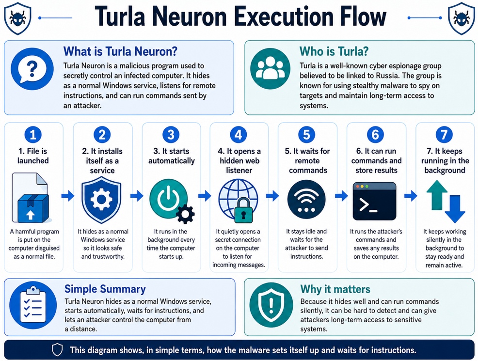

**Plain-language explanation:** The diagram summarizes how the program hides as a normal Windows service, starts with the computer, opens a listener, waits for instructions, runs commands, and remains available in the background.

**Technical finding:** The diagram models the analyzed sample's service persistence, listener, command-processing, and background-operation flow.

**Evidence limitation:** This is an explanatory diagram derived from the analysis; it is not a direct record of attacker activity.

## Scope and Evidence Standard

This report separates three evidence types:

1. **Static metadata** identifies the file and its format.
2. **Source-code-confirmed capability** describes logic visible through .NET decompilation without claiming that the logic ran.
3. **Dynamically observed behavior** describes artifacts captured during controlled execution in an isolated Windows virtual machine.

Public antivirus results provide corroborating context, not proof that every advertised capability executed. Laboratory paths are recorded as evidence of this run but are not treated as durable indicators. Temporary quarantine or Recycle Bin names are likewise excluded from detection guidance.

## Laboratory Safety and Methodology

The sample was examined in a disposable analysis virtual machine. A clean pre-execution snapshot provided a recovery point. Static inspection and YARA scanning did not execute the file. Dynamic execution was controlled and followed by Defender remediation and explicit checks for the file, service, and threat state.

### Evidence: Pre-execution virtual-machine snapshot

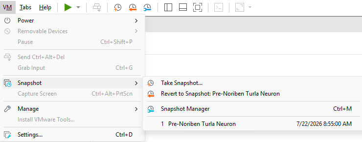

**Plain-language explanation:** The saved snapshot allowed the laboratory computer to be returned to its earlier state after the malware test.

**Technical finding:** VMware displays a snapshot named `Pre-Noriben Turla Neuron`, dated 2026-07-22 08:55 AM.

**Evidence limitation:** The image documents a recovery control; it does not show malware behavior.

## Sample Identification and Static Metadata

The analyzed filename was `Microsoft.Exchange.Service.exe`, with SHA-256 `d1d7a96fcadc137e80ad866c838502713db9cdfe59939342b8e3beacf9c7fe29`. VirusTotal displayed 52 of 68 security vendors flagging the file at capture time. Local metadata identified a PE32 graphical Windows executable for Intel 80386 and a Mono/.NET assembly. Exchange-themed product metadata supports the masquerading assessment.

### Evidence: VirusTotal file identity and SHA-256

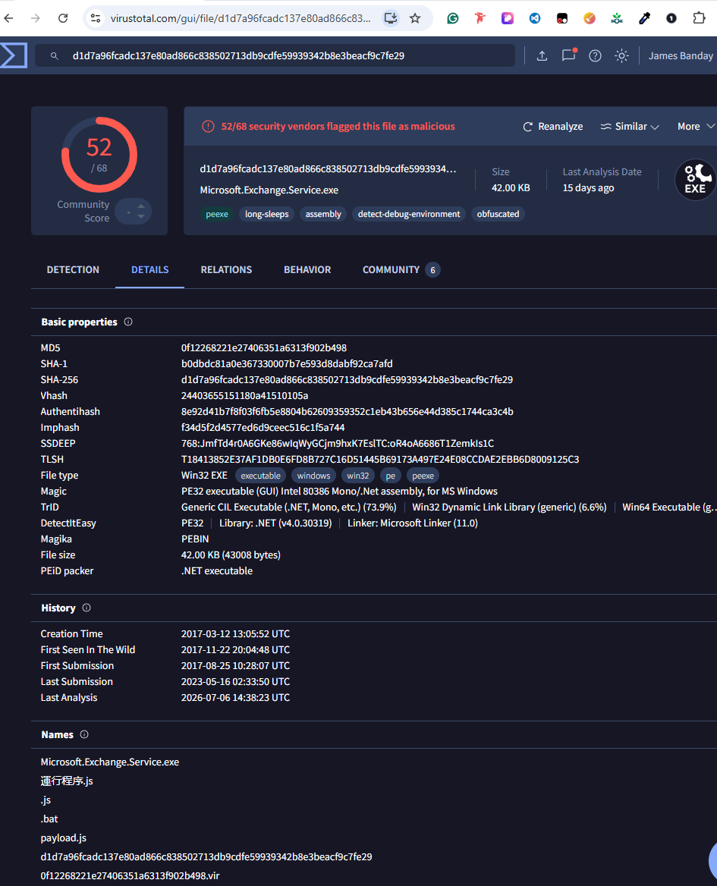

**Plain-language explanation:** The public scan page identifies the file by name and digital fingerprint and shows that many antivirus products considered it malicious.

**Technical finding:** The screenshot shows `Microsoft.Exchange.Service.exe`, the reported SHA-256, a 42.00 KB size, PE32/.NET characteristics, and 52/68 vendor detections.

**Evidence limitation:** Public detection results provide supporting reputation context and do not establish that every malware capability executed in this laboratory.

### Evidence: PE32 and .NET metadata

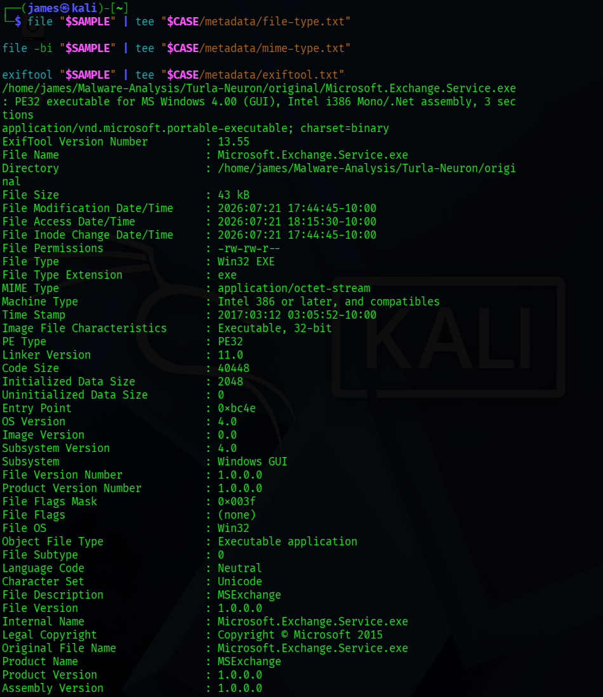

**Plain-language explanation:** File-inspection tools identify the sample as a small Windows program built with Microsoft’s .NET technology.

**Technical finding:** `file` and ExifTool output identify a PE32 Intel 386 Windows GUI executable, Mono/.NET assembly, approximately 43 KB, with Exchange-themed internal and product names.

**Evidence limitation:** File metadata describes structure and embedded labels; it does not prove runtime behavior or authentic Microsoft provenance.

## YARA Detection Engineering

Two complementary YARA rules were developed. `Turla_Neuron_Exact` hashes the entire file and recognizes only the analyzed SHA-256. `Turla_Neuron_Behavior` requires a PE file under 5 MB plus the service name, listener URL, and members of the embedded GUID, command-channel, and function-name groups. This combination is broader than a single hash while remaining tied to distinctive static artifacts.

YARA reads file content for matching; scanning is not execution. Both source and compiled validation views show the exact and behavioral rules matching the sample.

### Evidence: Refined YARA v2 source rule

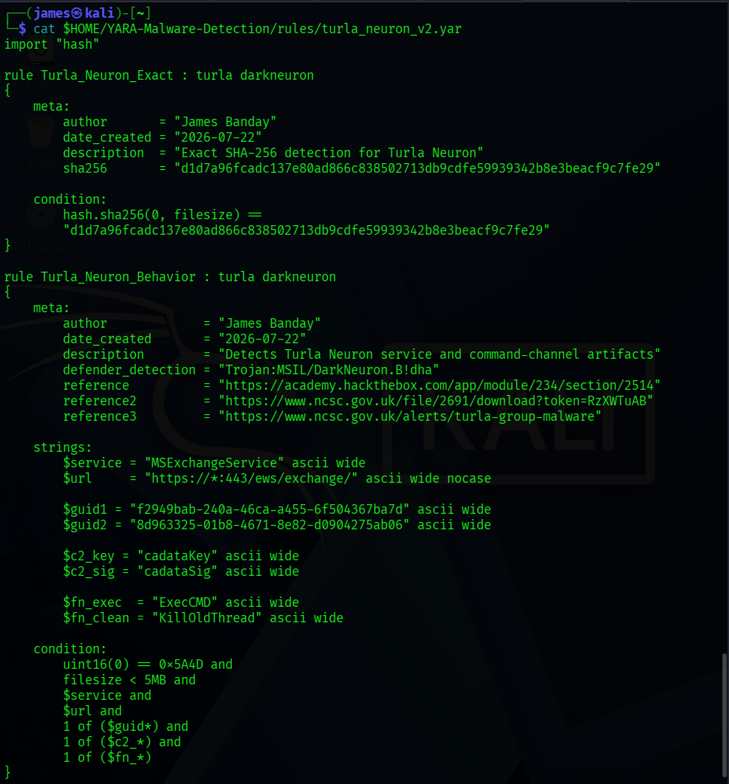

**Plain-language explanation:** This detection rule checks either the file’s exact fingerprint or a combination of distinctive text clues found inside the program.

**Technical finding:** The source defines `Turla_Neuron_Exact` with the confirmed SHA-256 and `Turla_Neuron_Behavior` with PE, size, service, URL, GUID, `cadata`, and function-name conditions.

**Evidence limitation:** This screenshot shows detection logic, not malware execution.

### Evidence: Compiled YARA exact and behavioral matches

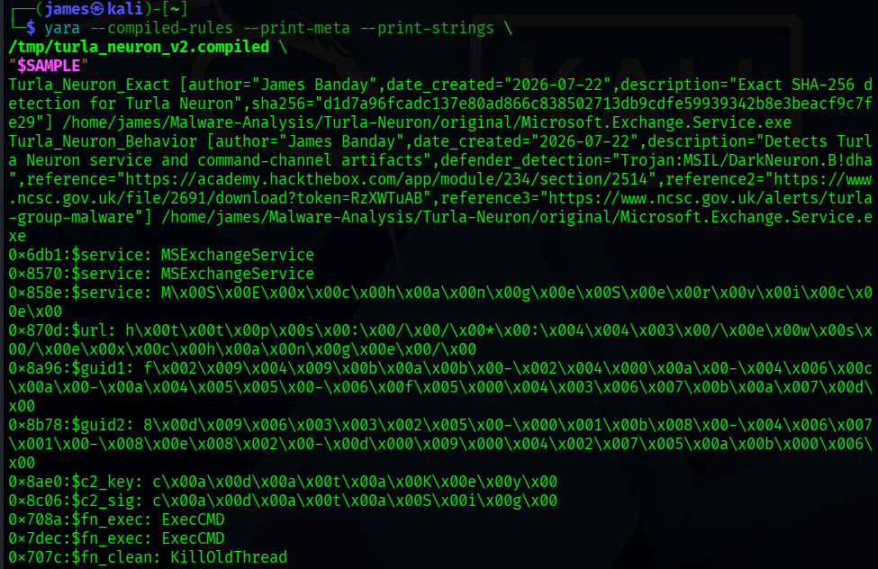

**Plain-language explanation:** The compiled scanner recognized the test file with both its exact fingerprint and its collection of distinctive internal clues.

**Technical finding:** Compiled-rule output displays matches for `Turla_Neuron_Exact` and `Turla_Neuron_Behavior`, including service, URL, GUID, command-channel, and function strings.

**Evidence limitation:** YARA matched static file content; the scan did not execute the sample or demonstrate live command-and-control.

## Static Reverse Engineering — Service Installation and Runtime

Decompilation identified command-line handling for `-install` and `-uninstall`. With no installation switch, the main method passes `MSExchangeService` to the Windows service framework. The installer defines Exchange-themed service metadata and starts the service after installation. On start, the service creates the HTTPS listener and a background storage-cleanup thread; on stop, it stops the listener and aborts that thread.

These are source-code-confirmed capabilities. Dynamic evidence later in this report separately confirms service persistence and HTTP.sys registration.

### Evidence: Install and uninstall command-line handling

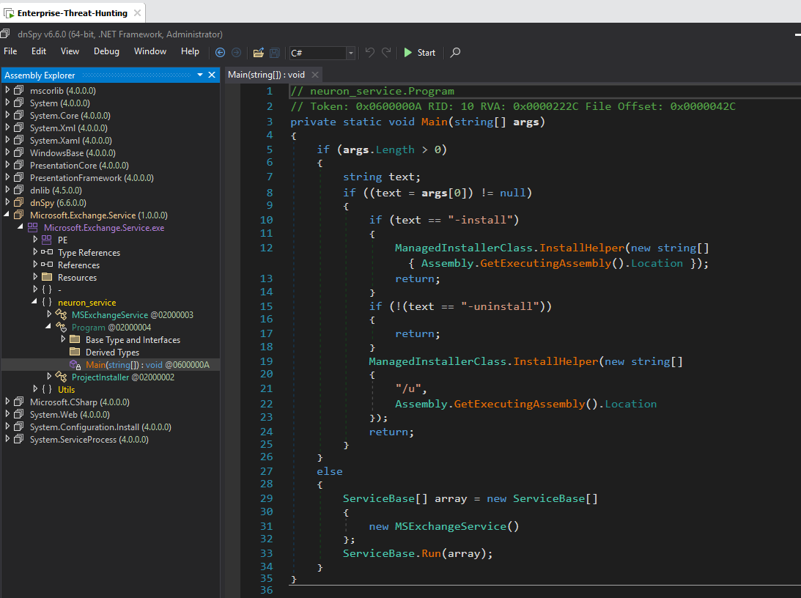

**Plain-language explanation:** The code accepts commands to add or remove itself as a Windows service; otherwise, it runs through the normal service system.

**Technical finding:** `Main` checks for `-install` and `-uninstall`, calls `ManagedInstallerClass.InstallHelper`, and otherwise invokes `ServiceBase.Run` with `MSExchangeService`.

**Evidence limitation:** Decompiled code demonstrates capability and configuration, not an observed installation event.

### Evidence: Automatic start after installation

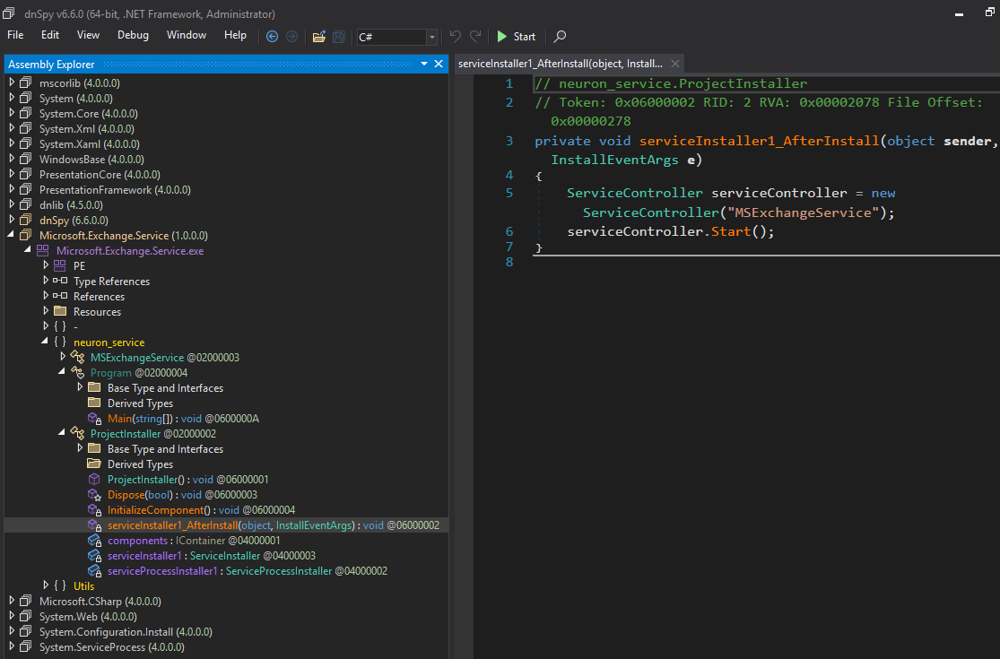

**Plain-language explanation:** After installation finishes, the program tells Windows to start its newly created service.

**Technical finding:** The installer’s `AfterInstall` handler creates a `ServiceController` for `MSExchangeService` and calls `Start()`.

**Evidence limitation:** Decompiled code shows intended post-install behavior; dynamic confirmation appears later.

### Evidence: Exchange-themed service configuration

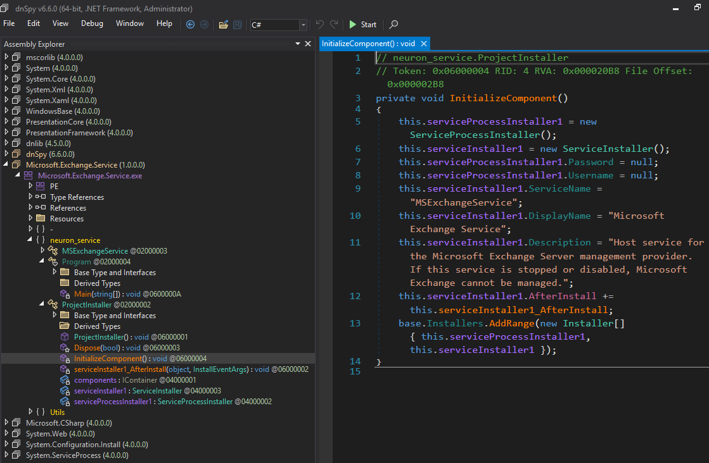

**Plain-language explanation:** The service uses Microsoft Exchange wording to look trustworthy to someone reviewing the computer.

**Technical finding:** Installer initialization sets `ServiceName` to `MSExchangeService`, `DisplayName` to `Microsoft Exchange Service`, and an Exchange management-provider description.

**Evidence limitation:** The screenshot confirms embedded configuration, not legitimate Microsoft authorship or a runtime Registry state.

### Evidence: Service startup and HTTPS listener

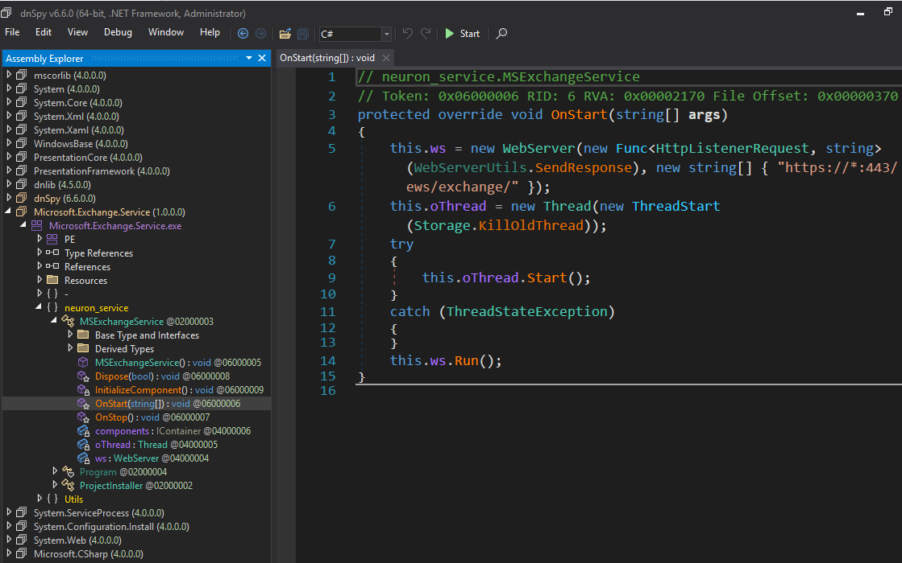

**Plain-language explanation:** When the service starts, it prepares a hidden web-style address for messages and starts a background housekeeping task.

**Technical finding:** `OnStart` constructs a `WebServer` for `https://*:443/ews/exchange/`, creates a thread for `Storage.KillOldThread`, starts it, and runs the web server.

**Evidence limitation:** This decompiled method shows implemented capability; it does not prove that an inbound connection occurred.

### Evidence: Service shutdown behavior

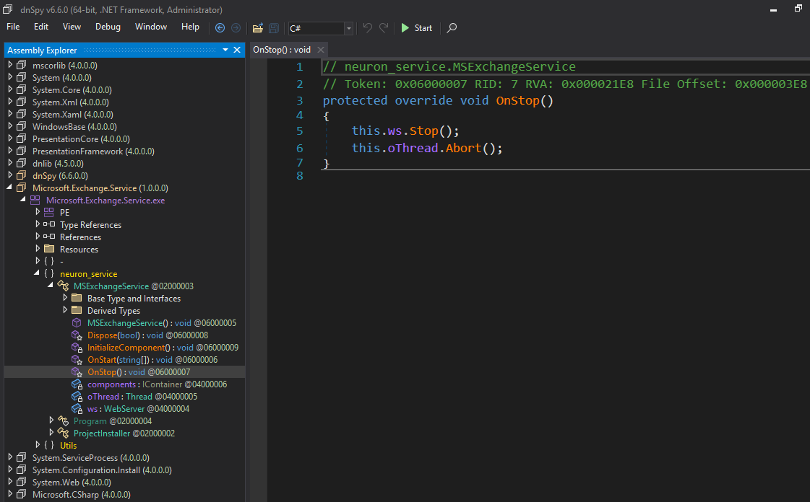

**Plain-language explanation:** When Windows stops the service, the program stops its listener and ends the background thread.

**Technical finding:** `OnStop` calls `ws.Stop()` and `oThread.Abort()`.

**Evidence limitation:** The source code defines shutdown behavior; the image is not a record of a stop event.

## Static Reverse Engineering — Request Validation and Command Channel

The request handler reads query-string or request-body values. Visible branches recognize `cid`, `cadataKey`, and `cadata`; the analyzed logic also uses `cadataSig`. The `cid` comparison includes the GUID `f2949bab-240a-46ca-a455-6f504367ba7d`. Processing of `cadata` shows Base64 decoding, an encryption routine invoked with `8d963325-01b8-4671-8e82-d0904275ab06`, JSON decoding, and dispatch based on a command field.

These findings support a structured encrypted request-and-response channel. The laboratory evidence does not show successful communication with an external controller.

### Evidence: Request parsing and client identifier validation

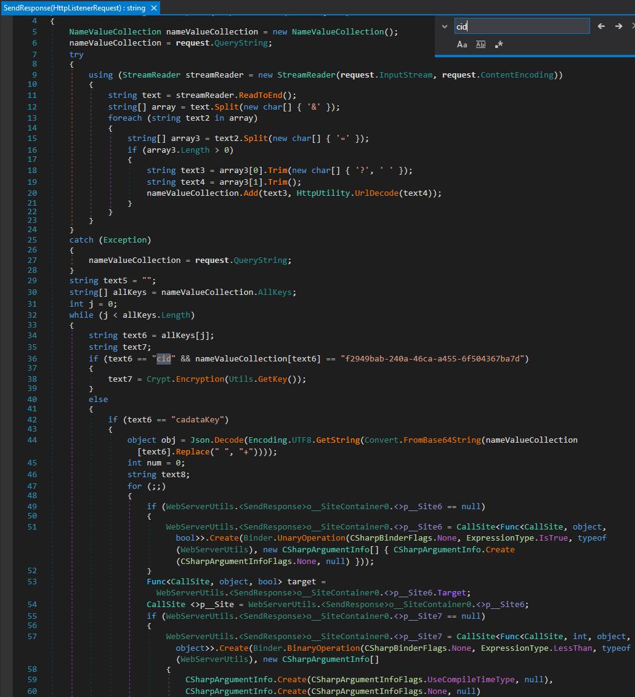

**Plain-language explanation:** The listener separates incoming values and checks for expected labels and a built-in identifier before processing them.

**Technical finding:** `SendResponse` parses URL-encoded name/value pairs, recognizes `cid` and `cadataKey`, and compares `cid` with embedded GUID `f2949bab-240a-46ca-a455-6f504367ba7d`.

**Evidence limitation:** This is request-processing capability in decompiled code; no accepted external request is shown.

### Evidence: Encrypted cadata command dispatch

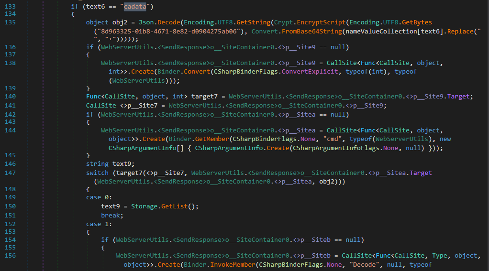

**Plain-language explanation:** The code can decode an encrypted instruction package and choose a storage or command-related action from it.

**Technical finding:** The `cadata` branch Base64-decodes input, passes bytes and GUID `8d963325-01b8-4671-8e82-d0904275ab06` to `Crypt.EncryptScript`, JSON-decodes the result, reads `cmd`, and enters a switch that includes `Storage.GetList()`.

**Evidence limitation:** Implemented parsing and dispatch do not establish successful external command-and-control communication.

## Static Reverse Engineering — Command Execution and File Operations

The command script implements hidden `cmd.exe` execution with redirected standard output and error, binary file writes, file reads with Base64 conversion, and configuration operations. These are malware capabilities present in code; they are not attacker commands observed during the isolated run.

### Evidence: Hidden command-shell creation

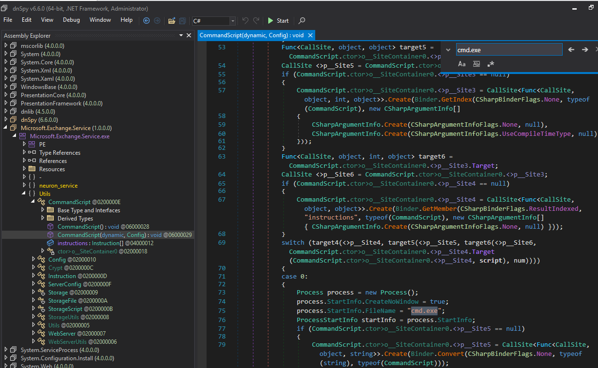

**Plain-language explanation:** One command type creates a Windows command shell without displaying a normal window.

**Technical finding:** Command type `0` constructs a `Process`, sets `CreateNoWindow = true`, and sets `FileName = "cmd.exe"`.

**Evidence limitation:** This is an implemented execution capability; the screenshot does not show an attacker-issued command.

### Evidence: Command output and error capture

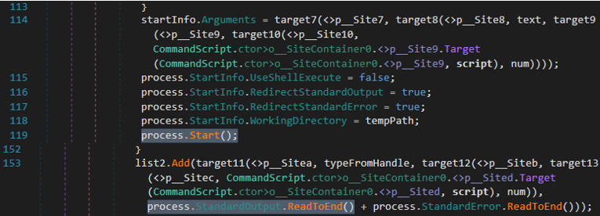

**Plain-language explanation:** The program can collect both the normal response and any error message produced by a command.

**Technical finding:** Process settings disable shell execution, redirect standard output and error, start the process, and read both streams to completion.

**Evidence limitation:** The source shows output-capture capability, not a command executed during the laboratory run.

### Evidence: File writing, reading, and Base64 conversion

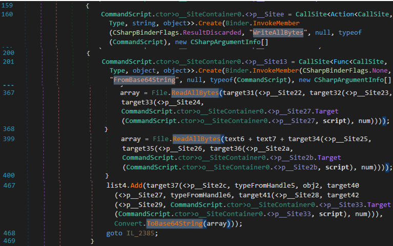

**Plain-language explanation:** The program can write received bytes to a file and read files back in a text-safe encoded form.

**Technical finding:** Visible branches invoke `WriteAllBytes`, `ReadAllBytes`, `FromBase64String`, and `ToBase64String`.

**Evidence limitation:** These are implemented file-operation capabilities and do not show a file transferred by an attacker.

### Evidence: Configuration-management commands

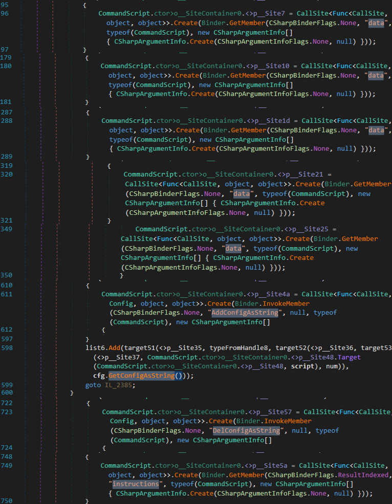

**Plain-language explanation:** Some instructions can add, retrieve, or remove settings used by the program.

**Technical finding:** The command script invokes configuration members including `AddConfigAsString`, `GetConfigAsString`, and `DelConfigAsString`.

**Evidence limitation:** The screenshot demonstrates dispatchable configuration functions, not observed remote use.

## Static Reverse Engineering — Registry Configuration

The configuration class recursively searches Registry subkeys and attempts to decrypt binary values. The decompiled fields include `Connect`, `URL`, `LastStart`, `FirstStart`, and `Interval`, plus the discovered subkey and value name. Writes serialize configuration as JSON, encrypt it using a key returned by `Utils.GetKey()`, and store the result as a binary Registry value. Related code derives that key from `MachineGuid`, making configuration host-specific.

### Evidence: Recursive Registry search and decryption

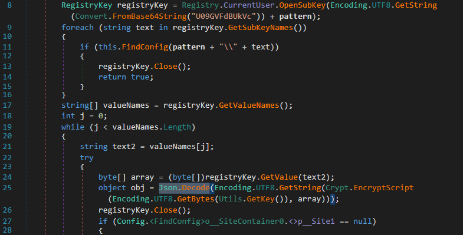

**Plain-language explanation:** The program searches through a user’s Registry settings and tries to decode stored binary configuration data.

**Technical finding:** `FindConfig` enumerates subkeys recursively, reads value names, casts values to byte arrays, calls `Crypt.EncryptScript` with `Utils.GetKey()`, converts to UTF-8, and JSON-decodes the result.

**Evidence limitation:** This is decompiled configuration logic; the screenshot does not identify a dynamically observed malicious Registry value.

### Evidence: Configuration fields and Registry location tracking

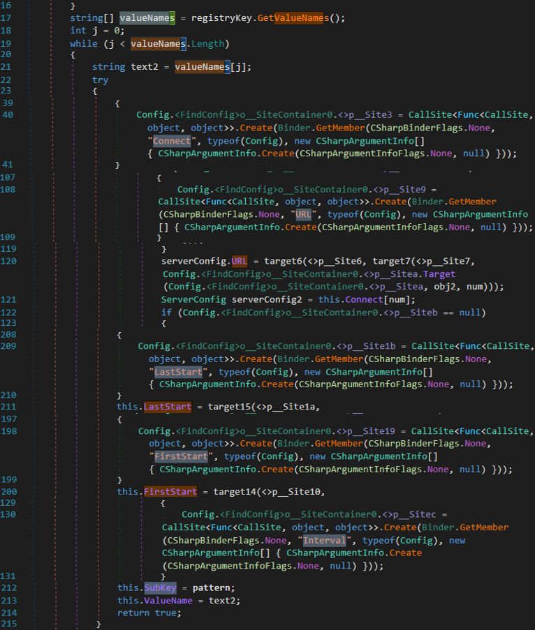

**Plain-language explanation:** The stored settings can track where to connect, timing information, and where the settings were found.

**Technical finding:** The decompiled accessors include `Connect`, `URL`, `LastStart`, `FirstStart`, and `Interval`, and assign `SubKey` and `ValueName`.

**Evidence limitation:** Field names show the configuration schema, not populated values observed in the laboratory.

### Evidence: Encrypted binary Registry write

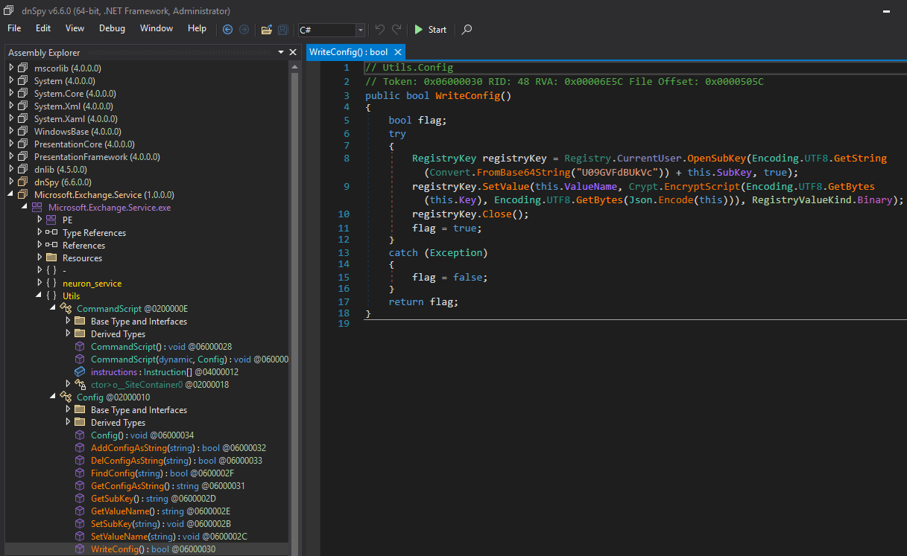

**Plain-language explanation:** The program can save its settings in the Registry after scrambling them so they are not readable at a glance.

**Technical finding:** `WriteConfig` opens a current-user subkey for writing and stores JSON-encoded configuration after `Crypt.EncryptScript`, using `RegistryValueKind.Binary`.

**Evidence limitation:** The method confirms write capability; it does not show a specific write occurring during execution.

## Static Reverse Engineering — Cryptography and Storage

The `EncryptScript` routine implements the recognizable key-scheduling and byte-stream operations of RC4-style symmetric encryption. Storage utilities create a temporary directory whose braced name is derived from `Utils.GetKey()`, which the analysis associates with the host MachineGuid. A persistent cleanup loop calls `Storage.KillOld(null)` and sleeps for 300,000 milliseconds—five minutes—between iterations.

### Evidence: RC4-style encryption implementation

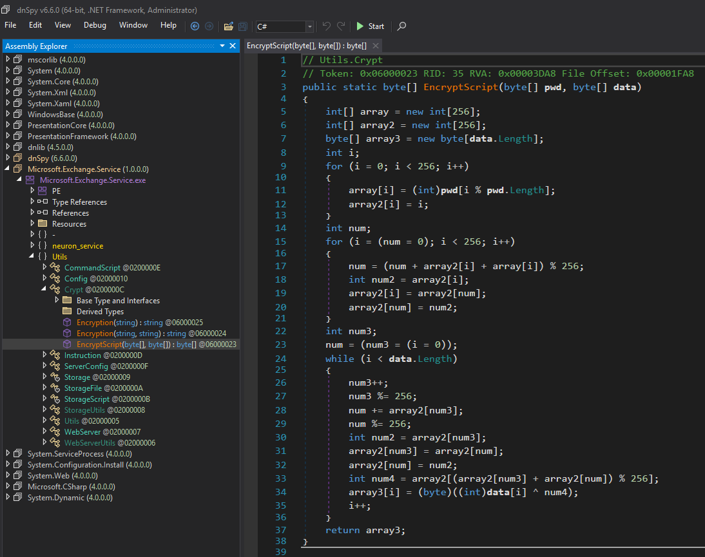

**Plain-language explanation:** The program contains a routine that scrambles and unscrambles data using a supplied key.

**Technical finding:** `EncryptScript` initializes and permutes 256-byte state arrays, then XORs data with a generated byte stream, consistent with an RC4-style algorithm.

**Evidence limitation:** The code confirms a cryptographic capability but does not show a live encrypted exchange.

### Evidence: Five-minute storage cleanup loop

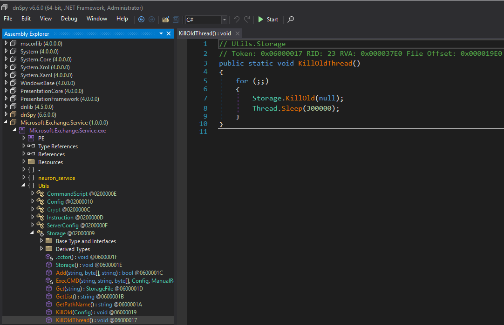

**Plain-language explanation:** A background task repeatedly cleans older stored items, waiting five minutes between checks.

**Technical finding:** `KillOldThread` loops indefinitely, calls `Storage.KillOld(null)`, and invokes `Thread.Sleep(300000)`.

**Evidence limitation:** The decompiled loop shows intended timing; it does not prove a stored item was deleted.

### Evidence: Host-specific temporary storage path

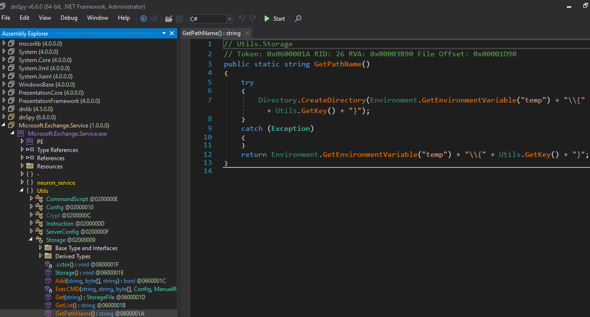

**Plain-language explanation:** The storage folder name is built from a value unique to the computer, so it can differ from one machine to another.

**Technical finding:** `GetPathName` creates and returns `%TEMP%\{` + `Utils.GetKey()` + `}`.

**Evidence limitation:** This is path-construction capability; the created directory is confirmed separately in dynamic evidence.

## Dynamic Analysis — Registry Modifications

### Evidence: ZoneMap Registry writes

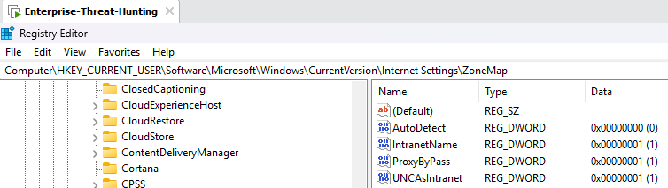

**Plain-language explanation:** The malware-related installer activity wrote Windows networking-zone settings associated with how local and network resources are classified. These values are supporting behavioral evidence, but they are not reliable standalone indicators because legitimate administrators or software can also configure them.

**Technical finding:** The executable wrote `AutoDetect = 0`, `IntranetName = 1`, `ProxyBypass = 1`, and `UNCAsIntranet = 1` under `HKCU\Software\Microsoft\Windows\CurrentVersion\Internet Settings\ZoneMap` during the monitored run.

**Evidence limitation:** No pre-execution Registry comparison is available, so the evidence does not establish that these values were previously different.

## Dynamic Analysis — Noriben Timeline

### Evidence: Filtered installation timeline

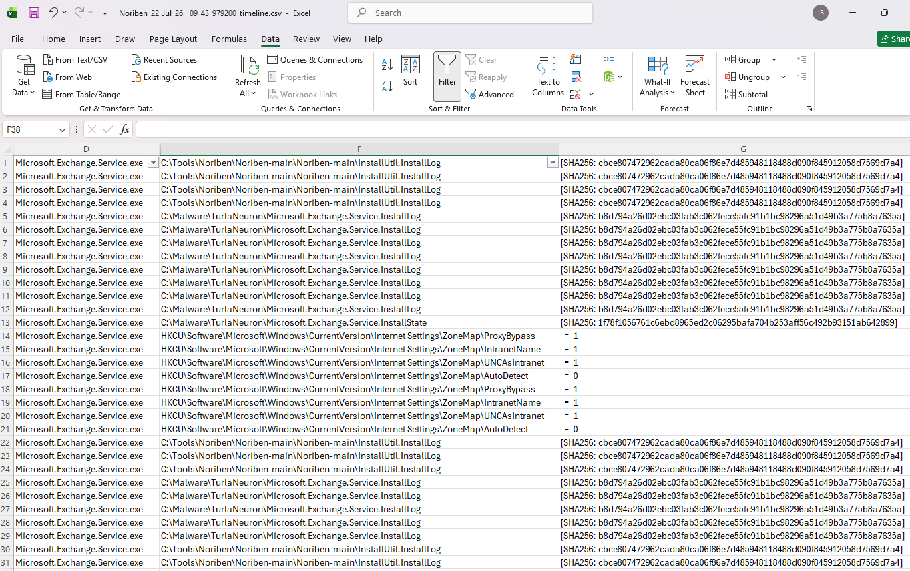

**Plain-language explanation:** The timeline records what the program touched while it was being installed. It shows the installer creating setup records and writing Windows settings.

**Technical finding:** Filtered Noriben timeline entries attributed to `Microsoft.Exchange.Service.exe` include creation or access involving `InstallUtil.InstallLog`, `Microsoft.Exchange.Service.InstallLog`, `Microsoft.Exchange.Service.InstallState`, and `ZoneMap` Registry values.

**Evidence limitation:** This is filtered Noriben timeline evidence, not a complete raw Procmon capture.

## Dynamic Analysis — Host-Specific Storage

### Evidence: MachineGuid-based LocalSystem storage

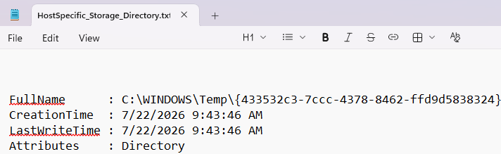

**Plain-language explanation:** The program created a folder whose name was based on the computer’s unique Windows identifier. This allows the malware to use a storage location that differs from one computer to another.

**Technical finding:** The `LocalSystem` service used `C:\Windows\Temp` rather than the analyst user’s temporary directory and created `C:\Windows\Temp\{433532c3-7ccc-4378-8462-ffd9d5838324}` on 2026-07-22 at approximately 09:43:46. The directory was empty when inspected; no task or output files were observed during this run.

**Evidence limitation:** The exact GUID is host-specific and is not a universal IOC. Hunt for the pattern `C:\Windows\Temp\{GUID}` with corroborating service or process evidence.

## Dynamic Analysis — HTTP.sys Listener

### Evidence: Active EWS-themed request queue

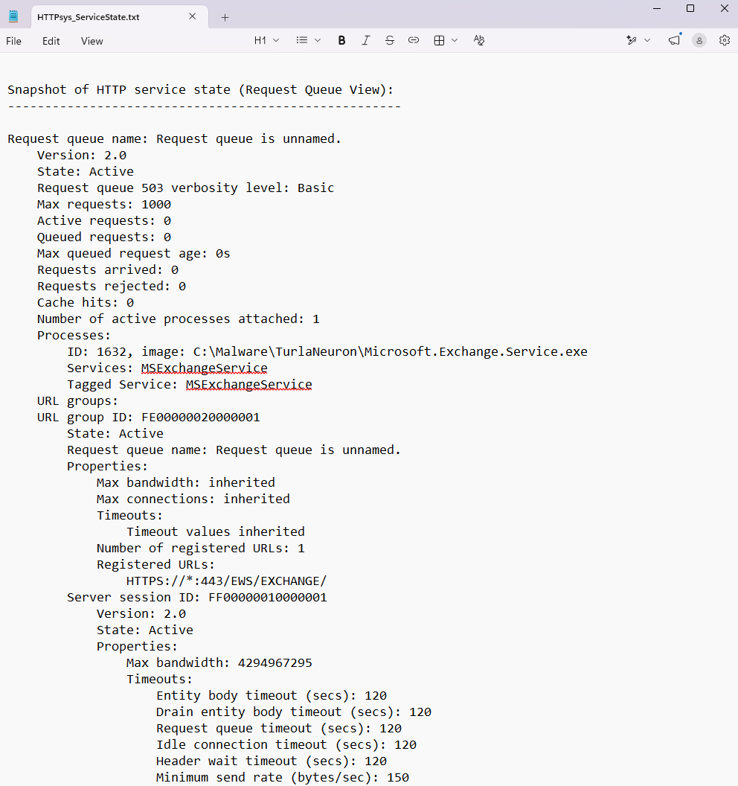

**Plain-language explanation:** The program opened a hidden web-listening location and waited for instructions. Because the test computer was disconnected from the network, no attacker requests arrived.

**Technical finding:** HTTP.sys shows an active request queue with one attached process, image `C:\Malware\TurlaNeuron\Microsoft.Exchange.Service.exe`, service `MSExchangeService`, and registered URL `HTTPS://*:443/EWS/EXCHANGE/`. The counters show `Requests arrived: 0` and `Requests rejected: 0`. Windows HTTP.sys owned the kernel listener, explaining why port 443 could appear associated with PID 4/System, while the request queue was attached to the Turla Neuron service process.

**Evidence limitation:** No inbound requests, successful attacker communication, SSL certificate binding for `0.0.0.0:443`, or Neuron-specific persistent URL ACL were observed. The listener is not proof of successful command-and-control traffic.

## Dynamic Analysis — Successful Service Installation

### Evidence: Installer-confirmed Windows service

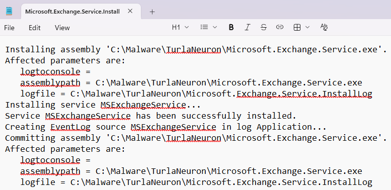

**Plain-language explanation:** The program successfully registered itself as a Windows service, which allows it to run in the background and return after a restart.

**Technical finding:** The installer log records `Installing service MSExchangeService`, `Service MSExchangeService has been successfully installed`, `Creating EventLog source MSExchangeService in log Application`, and assembly commit activity for `C:\Malware\TurlaNeuron\Microsoft.Exchange.Service.exe`.

**Evidence limitation:** The installed assembly path is evidence from this laboratory test only and must not be used as a universal production IOC.

## Dynamic Analysis — Event Log Source

### Evidence: Application Event Log source registration

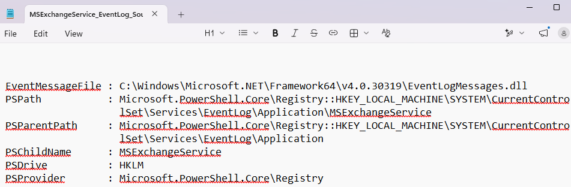

**Plain-language explanation:** The installer registered a name that could be used to write messages into the Windows Application log.

**Technical finding:** The screenshot confirms `HKLM\SYSTEM\CurrentControlSet\Services\EventLog\Application\MSExchangeService` with event-message file `C:\Windows\Microsoft.NET\Framework64\v4.0.30319\EventLogMessages.dll`.

**Evidence limitation:** The source was registered, but no matching Application events from `MSExchangeService` were found during the controlled run. This evidence does not establish that the malware wrote Event Log messages.

## Dynamic Analysis — Service Registry Persistence

### Evidence: Automatic LocalSystem service configuration

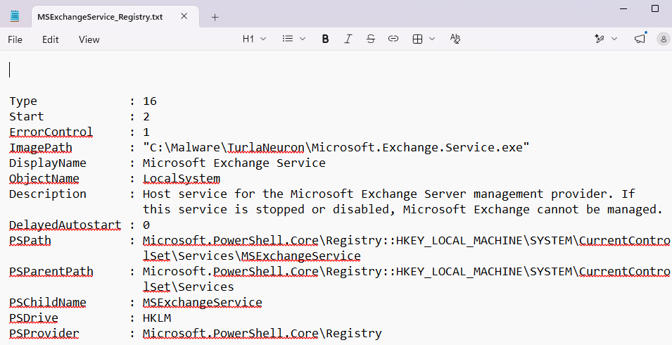

**Plain-language explanation:** Windows was configured to start the program automatically as a highly privileged background service whenever the computer started. The Microsoft Exchange name and description were used to make the service appear legitimate.

**Technical finding:** `HKLM\SYSTEM\CurrentControlSet\Services\MSExchangeService` contains `Type = 16`, `Start = 2`, `ErrorControl = 1`, `ImagePath = C:\Malware\TurlaNeuron\Microsoft.Exchange.Service.exe`, `DisplayName = Microsoft Exchange Service`, `ObjectName = LocalSystem`, and `DelayedAutoStart = 0`. `Start = 2` means automatic startup, `LocalSystem` provides highly privileged execution, `Type = 16` represents a dedicated service process, and `DelayedAutoStart = 0` specifies normal rather than delayed automatic startup.

**Evidence limitation:** The image path is specific to this analysis environment; production detection should key on the service and executable names without requiring the laboratory directory.

## Remediation — Defender Quarantine

### Evidence: DarkNeuron sample quarantined

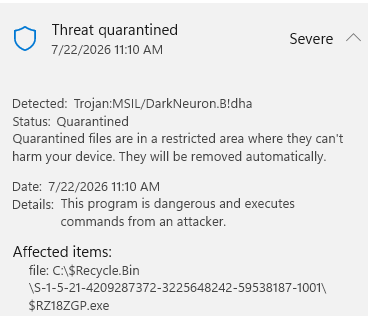

**Plain-language explanation:** Microsoft Defender isolated the malicious file so that it could no longer run normally.

**Technical finding:** Defender identifies `Trojan:MSIL/DarkNeuron.B!dha` with status `Quarantined`.

**Evidence limitation:** The randomized file under `C:\$Recycle.Bin` is a temporary Defender-managed quarantine artifact. Its filename and randomized name are not Turla Neuron IOCs.

## Remediation — Defender Detection History

### Evidence: Successful historical remediation actions

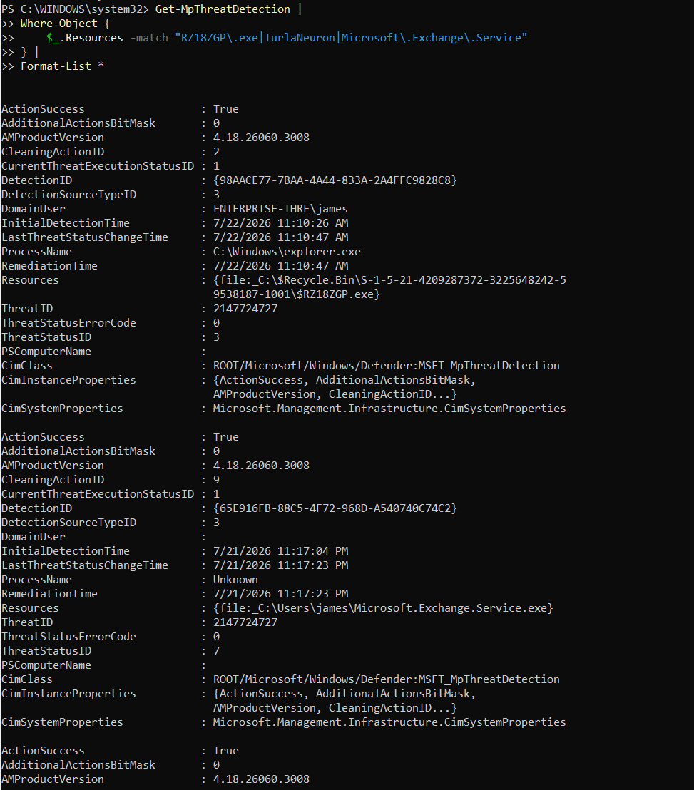

**Plain-language explanation:** Defender recorded the different times it found and successfully handled the malware file.

**Technical finding:** Multiple records refer to `Microsoft.Exchange.Service.exe`, the laboratory malware directory, and the temporary quarantine location. The displayed records include `ActionSuccess = True`, `ThreatStatusErrorCode = 0`, and `ThreatID = 2147724727`.

**Evidence limitation:** These are historical detection records; their continued presence does not mean the malware remained active. The laboratory user SID is environment-specific and is not a universal IOC.

## Remediation — Inactive Cleanup Verification

### Evidence: Sample and service absent after cleanup

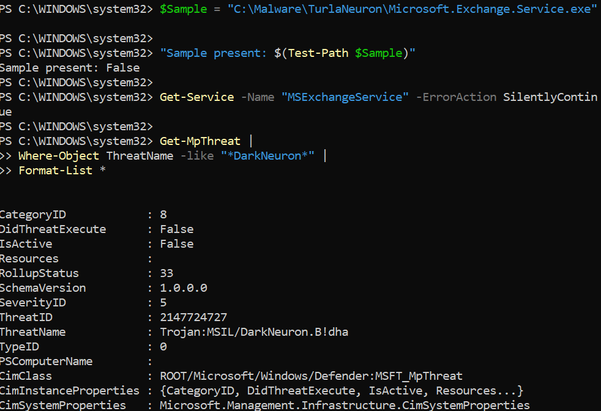

**Plain-language explanation:** The malware file was no longer present, its Windows service was not installed, and Defender no longer considered the threat active.

**Technical finding:** The screenshot shows `Sample present: False`, no output for `MSExchangeService`, `ThreatName: Trojan:MSIL/DarkNeuron.B!dha`, `IsActive: False`, and `DidThreatExecute: False` in the current Defender record.

**Evidence limitation:** `DidThreatExecute=False` describes the current Defender record in the restored and cleaned state. It does not contradict the intentional controlled execution documented in the isolated analysis snapshot.

## Remediation — Final Defender Scan

### Evidence: Final targeted scan shows inactive threat

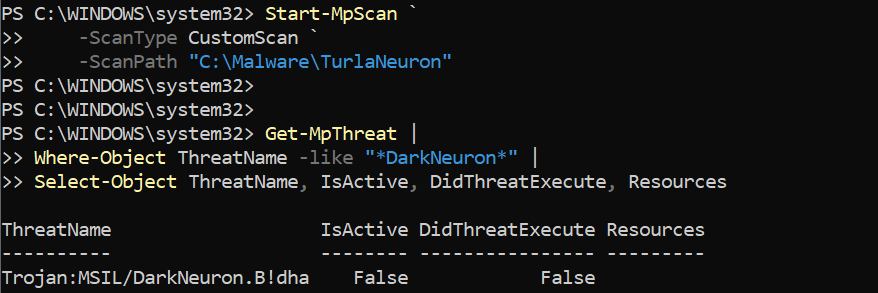

**Plain-language explanation:** A final security scan found no active copy of the malware in the former analysis directory.

**Technical finding:** A targeted Defender scan of `C:\Malware\TurlaNeuron` is followed by a threat record showing `IsActive = False`, `DidThreatExecute = False`, and no currently affected resources. Together with the cleanup check, the evidence supports that the Windows VM copy was removed or quarantined, the service was absent, and Defender considered the threat inactive.

**Evidence limitation:** Historical threat records remained available for evidence; the screenshot does not show that Defender erased those records.

## Detection and Response Guidance

High-confidence host detection should correlate Windows System Event ID 7045 with service name `MSExchangeService` and an image path containing `Microsoft.Exchange.Service.exe`. Display name `Microsoft Exchange Service`, `LocalSystem`, and automatic startup are useful supporting context but may be absent from normalized event data. Analysts should also look for the HTTP.sys URL, Event Log source, host-specific temporary directory, and associated service Registry key.

The exact SHA-256 is appropriate for identifying this analyzed sample. Behavioral YARA matching can identify files containing the combined service, listener, GUID, command-channel, and command-function artifacts. Analysts must validate file provenance, signature, path, hash, surrounding process activity, service creation authorization, and network evidence before drawing conclusions about attribution.

## Conclusions

The strongest dynamically confirmed findings are the installation and automatic start configuration of `MSExchangeService`, its execution as `LocalSystem`, creation of an Exchange-themed Event Log source, registration of the HTTPS EWS-style URL through HTTP.sys, and creation of a host-specific temporary directory. Static analysis adds command execution, file transfer, encrypted configuration, request validation, and storage-management capabilities.

No inbound requests or external command-and-control session were observed. Accordingly, this report does not claim that an operator issued commands during the run. Defender remediation and verification evidence indicate that the tested file and service were removed and the threat was inactive at the end of analysis.

## Annex A — Key Indicators and Artifacts

| Type | Value | Use |
|---|---|---|
| SHA-256 | `d1d7a96fcadc137e80ad866c838502713db9cdfe59939342b8e3beacf9c7fe29` | Exact sample identification |
| Filename | `Microsoft.Exchange.Service.exe` | Supporting indicator; validate with hash and context |
| Service name | `MSExchangeService` | High-value persistence indicator |
| Display name | `Microsoft Exchange Service` | Supporting masquerade indicator |
| Service account | `LocalSystem` | Supporting privilege context |
| Startup | Automatic (`Start=2`) | Persistence context |
| Service type | `WIN32_OWN_PROCESS` (`Type=16`) | Service configuration context |
| Listener | `HTTPS://*:443/EWS/EXCHANGE/` | High-value HTTP.sys artifact |
| Event Log source | `MSExchangeService` | Supporting persistence artifact |
| GUID | `f2949bab-240a-46ca-a455-6f504367ba7d` | Static request-validation artifact |
| GUID | `8d963325-01b8-4671-8e82-d0904275ab06` | Static encrypted-channel artifact |
| Defender name | `Trojan:MSIL/DarkNeuron.B!dha` | Product detection context |

Laboratory paths, the observed host-specific GUID directory name, and temporary Defender quarantine names are excluded as portable IOCs.

## Annex B — ATT&CK Mapping

| Technique | ID | Evidence basis |
|---|---|---|
| Windows Service | T1543.003 | Dynamically confirmed `MSExchangeService` installation and automatic persistence |
| Windows Command Shell | T1059.003 | Source-code-confirmed hidden `cmd.exe` execution |
| Data from Local System | T1005 | Source-code-confirmed local file reading |
| Exfiltration Over C2 Channel | T1041 | Potentially supported by file-read and response functions; not observed dynamically |
| Encrypted Channel | T1573 | Source-code-confirmed RC4-style request/response processing |
| Masquerading | T1036 | Exchange-themed service, description, filename, and URL path |

Mappings based only on capability are not claims that those techniques were exercised during the controlled run.

## Annex C — Evidence and Screenshot Index

| No. | Filename | Evidence category | What it demonstrates | Report section | Duplicate/alternate status |
|---:|---|---|---|---|---|
| 1 | `Pre-Noriben_Turla_Neuron_Snapshot.png` | Laboratory control | Pre-execution VM recovery snapshot | Laboratory Safety and Methodology | None identified |
| 2 | `TurlaNeuron_01_VirusTotal_SHA256_and_File_Details.png` | Static metadata | Filename, hash, size, format, and public detections | Sample Identification and Static Metadata | None identified |
| 3 | `TurlaNeuron_02_PE_and_DotNet_File_Metadata.png` | Static metadata | PE32 and .NET file characteristics | Sample Identification and Static Metadata | None identified |
| 4 | `TurlaNeuron_03_Refined_YARA_v2_Rule_Source_Code.png` | Detection engineering | Exact and behavioral YARA source | YARA Detection Engineering | None identified |
| 5 | `TurlaNeuron_04_Compiled_YARA_v2_Exact_and_Behavioral_Matches.png` | Detection validation | Compiled exact and behavioral matches | YARA Detection Engineering | None identified |
| 6 | `TurlaNeuron_05_dnSpy_Service_Installer_Configuration.png` | Static reverse engineering | Install/uninstall switches and service entry | Static Reverse Engineering — Service Installation and Runtime | None identified |
| 7 | `TurlaNeuron_06_dnSpy_AfterInstall_Automatic_Service_Start.png` | Static reverse engineering | Post-install service start | Static Reverse Engineering — Service Installation and Runtime | None identified |
| 8 | `TurlaNeuron_07_dnSpy_Service_Installer_Configuration.png` | Static reverse engineering | Service name, display name, and description | Static Reverse Engineering — Service Installation and Runtime | None identified |
| 9 | `TurlaNeuron_08_dnSpy_Service_OnStart_HTTPS_Listener.png` | Static reverse engineering | HTTPS listener and background thread startup | Static Reverse Engineering — Service Installation and Runtime | None identified |
| 10 | `TurlaNeuron_09_dnSpy_Service_OnStop.png` | Static reverse engineering | Listener and thread shutdown | Static Reverse Engineering — Service Installation and Runtime | None identified |
| 11 | `TurlaNeuron_10_dnSpy_SendResponse_Request_Validation.png` | Static reverse engineering | Request parsing, `cid`, and `cadataKey` | Static Reverse Engineering — Request Validation and Command Channel | None identified |
| 12 | `TurlaNeuron_11_dnSpy_Cadata_RC4_Remote_Storage_Command_Channel.png` | Static reverse engineering | Encrypted `cadata` decoding and command dispatch | Static Reverse Engineering — Request Validation and Command Channel | None identified |
| 13 | `TurlaNeuron_12_dnSpy_CommandScript_Type0_Command_Execution.png` | Static reverse engineering | Hidden `cmd.exe` capability | Static Reverse Engineering — Command Execution and File Operations | None identified |
| 14 | `TurlaNeuron_13_dnSpy_CommandScript_Type0_Execution_and_Output_Capture.png` | Static reverse engineering | Standard output and error capture | Static Reverse Engineering — Command Execution and File Operations | None identified |
| 15 | `TurlaNeuron_14_dnSpy_CommandScript_Types1_2_File_Transfer.png` | Static reverse engineering | File writes, reads, and Base64 conversion | Static Reverse Engineering — Command Execution and File Operations | None identified |
| 16 | `TurlaNeuron_15_dnSpy_CommandScript_Configuration_Operations.png` | Static reverse engineering | Configuration add, get, and delete functions | Static Reverse Engineering — Command Execution and File Operations | None identified |
| 17 | `TurlaNeuron_16_dnSpy_Config_Registry_Search_and_Decryption.png` | Static reverse engineering | Recursive Registry search and decryption | Static Reverse Engineering — Registry Configuration | None identified |
| 18 | `TurlaNeuron_17_dnSpy_Config_Fields_SubKey_ValueName.png` | Static reverse engineering | Configuration fields and location tracking | Static Reverse Engineering — Registry Configuration | None identified |
| 19 | `TurlaNeuron_18_dnSpy_Config_Encrypted_Registry_Write.png` | Static reverse engineering | Encrypted binary Registry writing | Static Reverse Engineering — Registry Configuration | None identified |
| 20 | `TurlaNeuron_19_dnSpy_RC4_EncryptScript_Implementation.png` | Static reverse engineering | RC4-style encryption routine | Static Reverse Engineering — Cryptography and Storage | None identified |
| 21 | `TurlaNeuron_20_dnSpy_Storage_Five_Minute_Polling.png` | Static reverse engineering | Five-minute storage cleanup loop | Static Reverse Engineering — Cryptography and Storage | None identified |
| 22 | `TurlaNeuron_21_dnSpy_Host_Specific_Storage_Path.png` | Static reverse engineering | Host-specific temporary path construction | Static Reverse Engineering — Cryptography and Storage | None identified |
| 23 | `TurlaNeuron_22_Dynamic_ZoneMap_Registry_Modifications.png` | Dynamic Analysis | ZoneMap values written during the monitored run | Dynamic Analysis — Registry Modifications | None identified |
| 24 | `TurlaNeuron_23_Noriben_Filtered_Timeline_Activity.png` | Dynamic Analysis | Filtered installer, InstallState, and ZoneMap activity | Dynamic Analysis — Noriben Timeline | None identified |
| 25 | `TurlaNeuron_24_Dynamic_HostSpecific_SYSTEM_Storage_Directory.png` | Dynamic Analysis | MachineGuid-based directory under Windows Temp | Dynamic Analysis — Host-Specific Storage | None identified |
| 26 | `TurlaNeuron_25_Dynamic_HTTPsys_EWS_Exchange_URL_Registration.png` | Dynamic Analysis | Active HTTP.sys queue, registered URL, and zero requests | Dynamic Analysis — HTTP.sys Listener | None identified |
| 27 | `TurlaNeuron_26_Dynamic_Installer_Log_Service_Success.png` | Dynamic Analysis | Successful service installation and commit | Dynamic Analysis — Successful Service Installation | None identified |
| 28 | `TurlaNeuron_27_Dynamic_MSExchangeService_EventLog_Source.png` | Dynamic Analysis | Application Event Log source registration | Dynamic Analysis — Event Log Source | None identified |
| 29 | `TurlaNeuron_28_Dynamic_Service_Registry_Persistence.png` | Dynamic Analysis | Automatic LocalSystem service persistence | Dynamic Analysis — Service Registry Persistence | None identified |
| 30 | `TurlaNeuron_29_Defender_DarkNeuron_Quarantined_RecycleBin.png` | Remediation and Cleanup | Defender quarantine status | Remediation — Defender Quarantine | None identified |
| 31 | `TurlaNeuron_30_Defender_DarkNeuron_Detection_and_Remediation_History.png` | Remediation and Cleanup | Successful historical Defender actions | Remediation — Defender Detection History | None identified |
| 32 | `TurlaNeuron_31_Defender_DarkNeuron_Inactive_Cleanup_Verification.png` | Remediation and Cleanup | Missing file and service with inactive threat | Remediation — Inactive Cleanup Verification | None identified |
| 33 | `TurlaNeuron_32_Defender_Final_Scan_Threat_Inactive.png` | Remediation and Cleanup | Final targeted scan and inactive threat state | Remediation — Final Defender Scan | None identified |
| 34 | `TurlaNeuron_Diagram.png` | Overview | Simplified execution flow | Executive Summary | None identified |

## References

- [Hack The Box Academy — module 234, section 2514](https://academy.hackthebox.com/app/module/234/section/2514)
- [Hack The Box Academy — module 238, section 2584](https://academy.hackthebox.com/app/module/238/section/2584)
- [UK NCSC — Turla Neuron technical report](https://www.ncsc.gov.uk/file/2691/download?token=RzXWTuAB)
- [UK NCSC — Turla group malware alert](https://www.ncsc.gov.uk/alerts/turla-group-malware)
