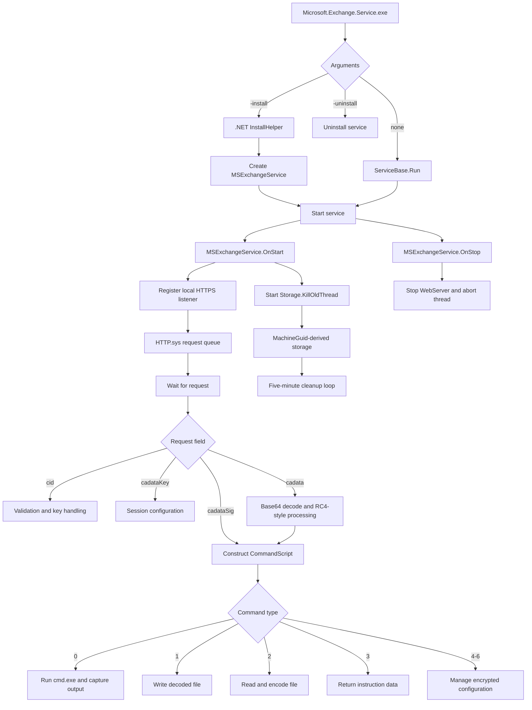

# Turla Neuron Execution Flow

## Plain-Language Flow

The executable can install or remove itself as a Windows service. After installation, it starts the fake Exchange service, opens a local HTTPS address, and creates a computer-specific storage folder. It then waits for specially formatted, encrypted instructions. The code can run commands, read or write files, and manage encrypted settings, but no outside request reached the service during the controlled test.

## Technical Numbered Flow

1. `neuron_service.Program.Main` reads command-line arguments.
2. `-install` calls `.NET ManagedInstallerClass.InstallHelper`; `-uninstall` passes `/u`; no argument invokes `ServiceBase.Run`.
3. `ProjectInstaller.InitializeComponent` configures `MSExchangeService` with Exchange-themed metadata.
4. `serviceInstaller1_AfterInstall` starts the installed service.
5. `MSExchangeService.OnStart` creates the web server and storage-maintenance thread.
6. The service registers `https://*:443/ews/exchange/`; HTTP.sys manages the kernel socket and application request queue.
7. `WebServerUtils.SendResponse` waits for and parses query-string or body fields.
8. `cid` selects validation/key handling; `cadataKey`, `cadata`, and `cadataSig` enter session, encrypted-data, or command workflows.
9. Data is Base64-decoded, URL-decoded where applicable, converted through UTF-8/JSON, and processed with RC4-style or RSA-related routines.
10. `CommandScript` dispatches numeric command types 0–6.
11. Results are serialized, encrypted, and Base64-encoded where supported.
12. `Storage.GetPathName` uses a host-derived key to create `C:\Windows\Temp\{GUID}` under LocalSystem.
13. `Storage.KillOldThread` calls `KillOld`, sleeps 300000 milliseconds, and repeats.
14. `MSExchangeService.OnStop` stops the web server and aborts the storage thread.

## Mermaid Flowchart

## Evidence Classification Legend

| Classification | Meaning |
|---|---|
| `confirmed_statically` | Decompiled code or embedded data directly supports the behavior. |
| `observed_dynamically` | A preserved runtime artifact directly supports the behavior. |
| `statically_confirmed_and_dynamically_observed` | Both code and runtime evidence support it. |
| `capability_only` | Code implements the behavior, but the controlled run did not exercise it. |
| `supporting_context` | Useful context that does not independently prove behavior. |
| `inferred_from_multiple_artifacts` | A bounded inference supported by multiple cited artifacts. |
| `not_exercised` | The relevant code path was not triggered during the run. |
| `not_observed` | Available runtime evidence did not show the event. |
| `evidence_limitation` | Missing or unusable evidence restricts the conclusion. |

## Flow Boundaries

- The install branch, service persistence, listener, and host-specific directory were dynamically confirmed.
- Request parsing, cryptographic workflows, numeric command dispatch, file operations, and hidden configuration are static findings.
- No request arrived, no live handshake was reconstructed, and no attacker command or file transfer was exercised.
- The wildcard HTTPS prefix is a local listener, not a remote C2 destination.
