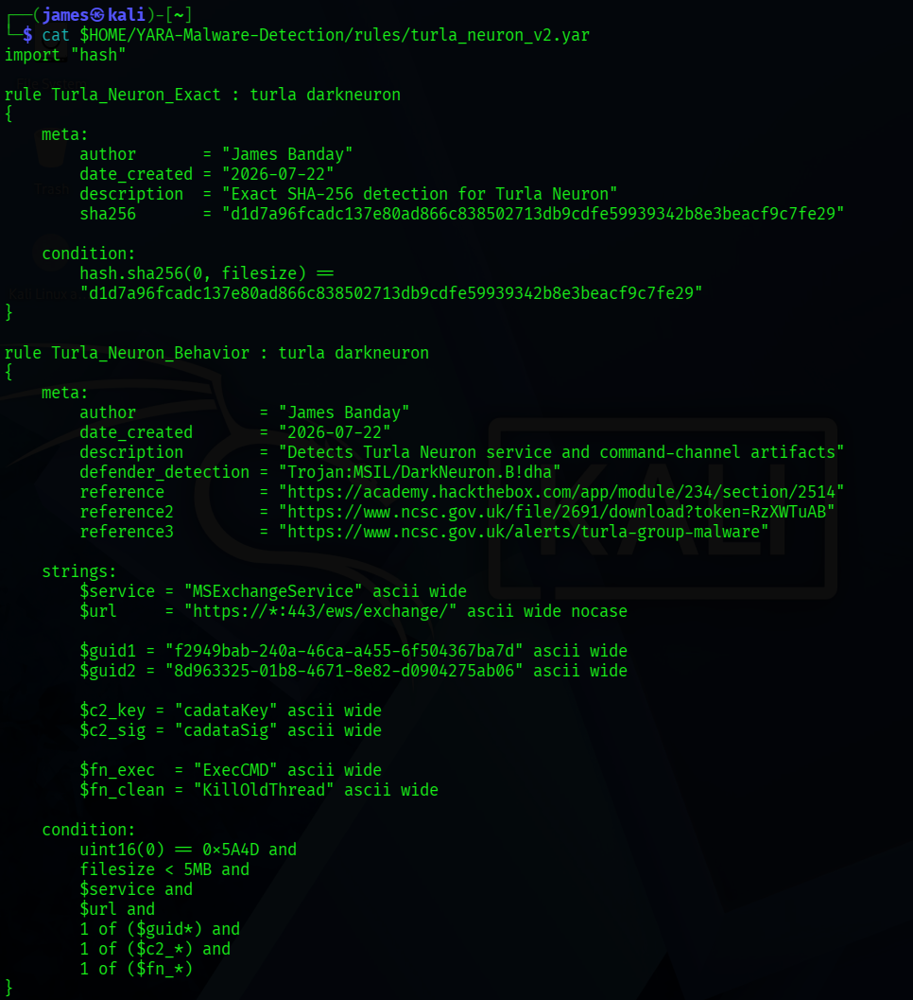

# Turla Neuron / DarkNeuron Static Analysis

## Analysis Overview

Static analysis examines a suspicious file without running it. It reveals the file’s identity, internal structure, embedded text, program logic, and potential capabilities while reducing the risk of activating the malware.

| Field | Value |
|---|---|
| Incident ID | MAL-2026-0721-NEURON |
| Sample | `Microsoft.Exchange.Service.exe` |
| Family | Turla Neuron |
| Alias | DarkNeuron |
| Defender detection | `Trojan:MSIL/DarkNeuron.B!dha` |
| Analyst | James Banday |
| Analysis date | 2026-07-22 |
| Analysis type | Static, non-execution analysis |

This package summarizes static findings and links to the detailed [dnSpy analysis](../dnspy/turla_neuron_dnspy_analysis.md) and [YARA source rule](../../detections/yara/turla_neuron_v2.yar) rather than reproducing them.

## Scope and Limitations

- The sample was not executed for this portion of the analysis.
- Metadata tools and dnSpy were used.
- Decompiled .NET code may differ slightly from the original source.
- Static capability does not prove attacker use.
- Dynamic confirmation is documented separately in the [incident report](../../reports/incident-report.md) and [Noriben package](../noriben/turla_neuron_noriben_analysis.md).
- No external C2 IP address or domain was identified through the available static evidence.
- No malware binary is stored in this directory.

## Sample Identity

| Indicator | Value | Confidence |
|---|---|---|
| Filename | `Microsoft.Exchange.Service.exe` | High |
| MD5 | `0f12268221e27406351a6313f902b498` | High |
| SHA-1 | `b0bdbc81a0e367330007b7e593d8ddabf92ca7afd` | High |
| SHA-256 | `d1d7a96fcadc137e80ad866c838502713db9cdfe59939342b8e3beacf9c7fe29` | High |
| Defender detection | `Trojan:MSIL/DarkNeuron.B!dha` | Supporting context |

SHA-256 is the preferred exact file identifier because it is the strongest of the confirmed hashes and is used by the exact YARA rule.

## File Metadata

| Property | Evidence-supported value | Classification |
|---|---|---|
| File type | PE32 executable | confirmed_file_metadata |
| Platform | Microsoft Windows | confirmed_file_metadata |
| Architecture | Intel i386 / 32-bit | confirmed_file_metadata |
| Runtime | Mono/.NET assembly | confirmed_file_metadata |
| Subsystem | Windows GUI | confirmed_file_metadata |
| Size | 43,008 bytes / 42 KB | confirmed_file_metadata |
| .NET metadata version | `v4.0.30319` | confirmed_file_metadata |
| Linker version | 11.0 | confirmed_file_metadata |
| File description | `MSExchange` | confirmed_file_metadata |
| Product name | `MSExchange` | confirmed_file_metadata |
| Original filename | `Microsoft.Exchange.Service.exe` | confirmed_file_metadata |
| File/product/assembly version | `1.0.0.0` | confirmed_file_metadata |
| PE metadata timestamp | 2017-03-12 03:05:52 | supporting_context |

The PE metadata timestamp is potentially compiler-controlled and not independently verified. It is not treated as proof of build time or attribution.

### Metadata evidence

## Public Intelligence Context

The VirusTotal screenshot shows the same SHA-256 as the analyzed file and identifies `Microsoft.Exchange.Service.exe`. At capture time, the page visibly reported 52 of 68 security vendors flagging the file as malicious and displayed PE32/.NET metadata.

VirusTotal labels and multi-engine results provide sample-identification and reputation context. They do not independently prove every capability described in this report or establish that each capability executed.

## PE and .NET Characteristics

The file is a Windows portable executable containing managed .NET code. That structure allowed dnSpy to reconstruct readable C#-like methods and classes. Its approximately 42 KB size is small, but file size does not limit the potential impact of service persistence, command execution, file operations, encrypted configuration, and listener functionality.

## Embedded High-Value Artifacts

| Category | Artifact | Static significance | Detection value |
|---|---|---|---|
| Service | `MSExchangeService` | Embedded service name | High; distinctive with service creation |
| Service | `Microsoft Exchange Service` | Exchange-themed display name | Medium; correlate with service name and image |
| Service | `Microsoft.Exchange.Service.exe` | Embedded and observed filename | High with service or hash context |
| Service | Exchange-themed service description | Masquerades as an Exchange management provider | Medium; description can be copied |
| Listener | `https://*:443/ews/exchange/` | Wildcard local HTTPS listener prefix | High; not a remote destination |
| Listener | `/ews/exchange/` | EWS-themed URI path | High on non-Exchange systems |
| Protocol | `cid` | Request-validation field | Medium; broad by itself |
| Protocol | `cadataKey` | Encrypted-session field | High in correlated requests or files |
| Protocol | `cadata` | Command/storage data field | Medium; needs context |
| Protocol | `cadataSig` | Encrypted command-result field | High in correlated requests or files |
| Identifier | `f2949bab-240a-46ca-a455-6f504367ba7d` | Validation GUID | High |
| Identifier | `8d963325-01b8-4671-8e82-d0904275ab06` | Fallback encryption GUID | High |
| Function | `ExecCMD` | Command-execution artifact | High with related artifacts |
| Function | `KillOldThread` | Storage-cleanup artifact | High with related artifacts |
| Function | `EncryptScript` | RC4-style processing routine | Medium |
| Task | `MSXEWS` | Task marker | Medium; supporting context |
| Task | `TVNYRVdT` | Base64 representation of `MSXEWS` | Medium; supporting context |

The service name, listener path, embedded GUIDs, `cadataKey`, `cadataSig`, and correlated function names are the most distinctive. Values such as `cid`, `cadata`, port 443, and Exchange wording require additional context.

## Program Entry Point

dnSpy confirms that:

- `-install` invokes the .NET installation routine.
- `-uninstall` invokes the uninstall routine using `/u`.
- Execution without recognized arguments starts `MSExchangeService` through `ServiceBase.Run`.

**Plain-language explanation:** The program contains built-in instructions to install itself as a Windows background service.

See the [dnSpy function map](../dnspy/turla_neuron_dnspy_function_map.csv) for exact component and method mappings.

## Service Installation and Persistence Capability

**Classification: confirmed_statically**

- ServiceName: `MSExchangeService`
- DisplayName: `Microsoft Exchange Service`
- Automatic service startup
- Immediate start after installation
- Exchange-themed service description
- Windows service-based persistence

The service name and description were chosen to resemble Microsoft Exchange software, which may help the program avoid casual notice.

Separate dynamic evidence confirms the service installation and persistence; that corroboration is not reclassified as a static finding here.

## HTTPS Listener Capability

**Classification: confirmed_statically**

- Listener prefix: `https://*:443/ews/exchange/`
- Handler: `WebServerUtils.SendResponse`
- The listener starts from `MSExchangeService.OnStart`.
- The listener stops from `MSExchangeService.OnStop`.

The wildcard prefix accepts traffic on applicable local interfaces. It is not an external C2 destination and does not prove that any communication succeeded.

## Command-Channel Logic

**Classification: confirmed_statically; external requests not observed**

The request handler implements:

- Query-string and request-body parsing.
- URL decoding and key-value processing.
- `cid` validation.
- `cadataKey`, `cadata`, and `cadataSig` processing.
- Base64 decoding and encoding.
- JSON parsing and serialization.
- Encrypted request and response handling.

**Plain-language explanation:** The malware expects specially formatted and encrypted messages before it will process instructions.

## Command Capabilities

| Command type | Capability | Classification |
|---:|---|---|
| 0 | Hidden `cmd.exe` execution with standard output and error collection | capability_only |
| 1 | Write a file from Base64-decoded data | capability_only |
| 2 | Read a file and return Base64-encoded content | capability_only |
| 3 | Return or pass through selected instruction data | confirmed_statically |
| 4 | Retrieve configuration with `GetConfigAsString` | capability_only |
| 5 | Add configuration with `AddConfigAsString` | capability_only |
| 6 | Delete configuration with `DelConfigAsString` | capability_only |

These are implemented capabilities, not claims that an attacker exercised them.

## Registry Configuration Capability

**Classification: capability_only**

The configuration code supports:

- Recursive search under `HKCU\SOFTWARE`.
- Registry value enumeration.
- Reading encrypted binary configuration.
- A key derived through `Utils.GetKey`, associated with the host MachineGuid.
- Decryption and JSON configuration decoding.
- Encrypted `REG_BINARY` writes.

Supported fields include `Connect`, `URL`, `LastStart`, `FirstStart`, `Interval`, `SubKey`, and `ValueName`.

The exact hidden configuration location was not confirmed dynamically.

## Cryptographic Capabilities

### RC4-style processing

**Classification: confirmed_statically**

`EncryptScript` uses two 256-entry arrays, key scheduling, pseudo-random generation, and XOR transformation. The symmetric operation can be used for both encryption and decryption.

### RSA processing

**Classification: supporting_context**

The cryptography component supports an embedded 1024-bit RSA public key, exponent 65537, OAEP encryption, and Base64 output. No private key was recovered, so RSA-encrypted content could not be decrypted from the sample alone.

**Plain-language explanation:** The program encrypts instructions and configuration data so they are more difficult to inspect.

## Storage and Task Processing

**Classification: confirmed_statically and supporting_context**

- Storage path derived from the host MachineGuid.
- Generalized path: `C:\Windows\Temp\{GUID}` under the dynamically observed `LocalSystem` context.
- `KillOldThread` calls cleanup every 300,000 milliseconds, or five minutes.
- Task marker: `MSXEWS`.
- Base64 marker: `TVNYRVdT`.
- `.TMP` output is retained as a supporting task artifact.

The exact laboratory MachineGuid is not a universal IOC. Seven-day cleanup and duplicate-task handling are not promoted as findings because the indexed evidence package does not directly establish them.

## YARA Detection Validation

Two rules were validated:

- `Turla_Neuron_Exact` matches the confirmed SHA-256.
- `Turla_Neuron_Behavior` matches the distinctive service, listener, GUID, protocol, and function artifact combination.

The captured source-rule and compiled-rule results both show the exact and behavioral matches. YARA scanning read the file; it did not execute it.

The complete rule remains at [turla_neuron_v2.yar](../../detections/yara/turla_neuron_v2.yar). The compiled-match screenshot is preserved, but the compiled rule file is not currently present under `results/yara/`.

## Static-to-Dynamic Correlation

| Static finding | Dynamic corroboration | Status |
|---|---|---|
| Service installation capability | Installer log confirms installation | confirmed_dynamically |
| Automatic service start | Service Registry and runtime evidence | confirmed_dynamically |
| `LocalSystem` persistence | Service Registry `ObjectName` | confirmed_dynamically |
| HTTP.sys `/ews/exchange/` listener | Active request queue with zero requests | confirmed_dynamically |
| MachineGuid-based directory | Braced directory under `C:\Windows\Temp` | confirmed_dynamically |
| Installer artifacts | Filtered Noriben timeline | supporting_evidence |
| Event Log source | Application source Registry key | confirmed_dynamically |
| ZoneMap writes | Filtered timeline and Registry screenshot | supporting_evidence |
| Command execution capability | No attacker command captured | not_exercised |
| File-transfer capability | No transfer captured | not_exercised |
| Encrypted Registry configuration | No hidden value confirmed | confirmed_statically_only |

Detailed runtime evidence remains in `case-studies/turla-neuron/results/dynamic/` and the [Noriben analysis](../noriben/turla_neuron_noriben_analysis.md).

## Detection Engineering Value

### YARA

Static detection can combine:

- The exact sample hash.
- Service name and listener URL.
- Embedded GUIDs.
- Request fields.
- Function names.

### Sigma

Service-installation detection can correlate:

- `MSExchangeService`.
- An ImagePath containing `Microsoft.Exchange.Service.exe`.
- Automatic startup.
- `LocalSystem` as supporting context.

See the [Sigma rule](../../detections/sigma/win_system_turla_neuron_service_install.yml).

### Splunk and Sysmon

Recommended searches include:

- `Microsoft.Exchange.Service.exe` launched by `services.exe`.
- `cmd.exe` spawned by an unexpected service.
- Service Registry creation.
- Exchange-themed services on non-Exchange hosts.
- Unexpected port-443 listeners.

### Network Detection

Recommended correlated artifacts include `/ews/exchange/`, `cid`, `cadataKey`, `cadata`, and `cadataSig`.

These are detection recommendations, not automatically validated detections.

## MITRE ATT&CK Mapping

| Technique | ID | Static evidence | Classification |
|---|---|---|---|
| Windows Service | T1543.003 | Installer and service runtime code | confirmed_statically |
| Windows Command Shell | T1059.003 | Hidden `cmd.exe` branch | capability_only |
| Modify Registry | T1112 | Encrypted configuration read/write | capability_only |
| Web Protocols | T1071.001 | HTTPS listener and request parser | capability_only |
| Data Encoding | T1132.001 | Base64 request, response, and file conversion | confirmed_statically |
| Encrypted Channel | T1573 | RC4-style and RSA-related processing | capability_only |
| Ingress Tool Transfer | T1105 | File write/read command types | capability_only |
| Deobfuscate/Decode Files or Information | T1140 | Base64, decryption, and JSON decoding | confirmed_statically |

Capability-only techniques are not presented as observed attacker behavior.

## Key Findings

- Exact sample identity was established through three hashes.
- The executable is a managed 32-bit .NET Windows program.
- It can install and start a fake Exchange service.
- It contains an HTTPS command-listener path.
- It supports encrypted command execution and file operations.
- It can store encrypted configuration in the Registry.
- It uses host-specific storage.
- Exact and behavioral YARA rules matched successfully.

## Evidence Limitations

- Static analysis does not prove execution.
- Decompiled code is not the original source.
- No external C2 infrastructure was identified.
- No attacker request or successful remote command was observed.
- No private RSA key was recovered.
- Some capabilities were not dynamically exercised.
- Laboratory paths and identifiers are not universal IOCs.

## Evidence References

| Evidence | Repository link | Purpose |
|---|---|---|
| VirusTotal sample screenshot | [TurlaNeuron_01](../../screenshots/TurlaNeuron_01_VirusTotal_SHA256_and_File_Details.png) | Hash, filename, public detections, and metadata |
| PE/.NET metadata screenshot | [TurlaNeuron_02](../../screenshots/TurlaNeuron_02_PE_and_DotNet_File_Metadata.png) | File format, architecture, size, and version metadata |
| YARA source screenshot | [TurlaNeuron_03](../../screenshots/TurlaNeuron_03_Refined_YARA_v2_Rule_Source_Code.png) | Exact and behavioral rule logic |
| Compiled YARA match screenshot | [TurlaNeuron_04 compiled](../../screenshots/TurlaNeuron_04_Compiled_YARA_v2_Exact_and_Behavioral_Matches.png) | Exact and behavioral matches |
| Alternate YARA source screenshot | [TurlaNeuron_04 source](../../screenshots/TurlaNeuron_04_Refined_YARA_v2_Rule_Source_Code.png) | Alternate rule-source capture |
| Detailed dnSpy package | [dnSpy analysis](../dnspy/turla_neuron_dnspy_analysis.md) | Method-level static reverse engineering |
| YARA source rule | [turla_neuron_v2.yar](../../detections/yara/turla_neuron_v2.yar) | Detection logic |
| YARA compiled validation | [Compiled-match screenshot](../../screenshots/TurlaNeuron_04_Compiled_YARA_v2_Exact_and_Behavioral_Matches.png) | Preserved evidence because the compiled rule file is not currently present |
| IOC package | [turla_neuron_iocs.md](../../iocs/turla_neuron_iocs.md) | Deployable and contextual indicators |
| Incident report | [incident-report.md](../../reports/incident-report.md) | Overall static and dynamic conclusions |
| Public references | [turla_neuron_references.md](../../references/turla_neuron_references.md) | Training, threat reporting, tools, and ATT&CK sources |
